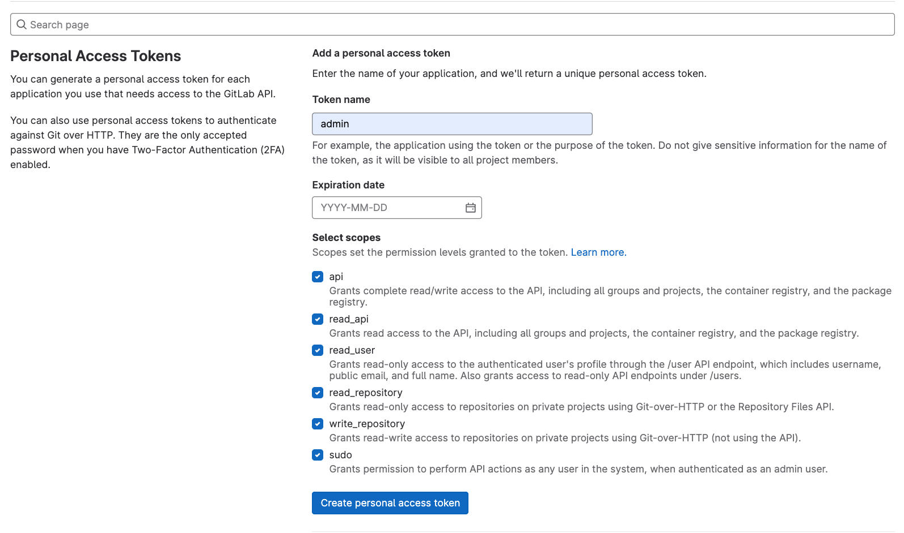
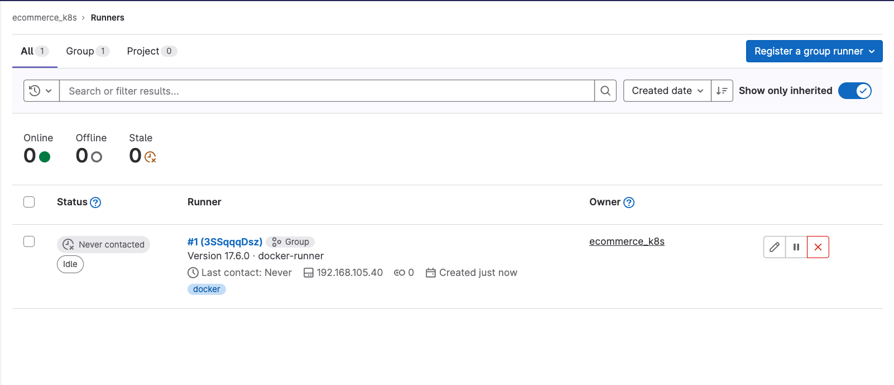
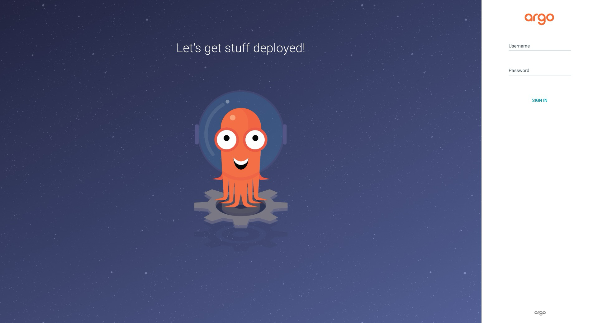
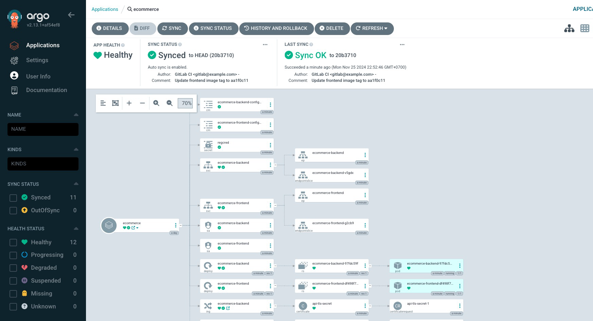
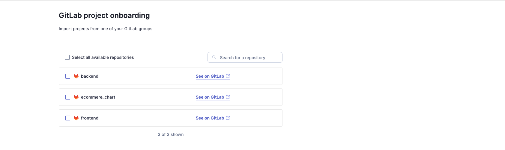
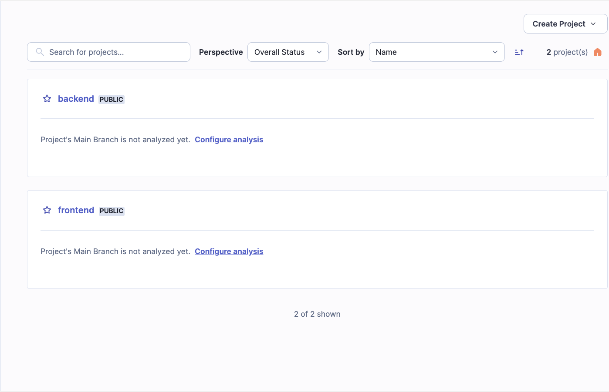

## Chương 2: Công cụ và hệ sinh thái trong CI/CD

### 2.1. Tổng quan các công cụ CI/CD phổ biến

Trong phần này, chúng ta sẽ điểm qua những công cụ CI/CD phổ biến nhất hiện nay, giúp bạn hiểu rõ hơn về các lựa chọn có sẵn. Dưới đây là một số công cụ nổi bật:

1. **Jenkins**:
   - Là một trong những công cụ CI/CD lâu đời và được sử dụng rộng rãi.
   - Hỗ trợ nhiều plugin cho phép tích hợp với nhiều công nghệ khác nhau.
   - Cung cấp khả năng tùy chỉnh cao và có thể mở rộng dễ dàng.

2. **GitLab CI/CD**:
   - Tích hợp trực tiếp với GitLab, giúp quản lý mã nguồn và quy trình CI/CD trong cùng một nền tảng.
   - Cung cấp giao diện người dùng thân thiện và dễ sử dụng.
   - Hỗ trợ tự động hóa quy trình kiểm tra và triển khai.

3. **CircleCI**:
   - Nổi bật với khả năng tích hợp dễ dàng và tốc độ triển khai nhanh.
   - Cung cấp các tùy chọn cấu hình linh hoạt thông qua file cấu hình YAML.
   - Hỗ trợ nhiều ngôn ngữ lập trình và môi trường khác nhau.

4. **TravisCI**:
   - Thích hợp cho các dự án mã nguồn mở và có khả năng tích hợp tốt với GitHub.
   - Cung cấp khả năng kiểm tra tự động cho các pull request.
   - Dễ dàng cấu hình và sử dụng cho các dự án nhỏ.

5. **Bamboo**:
   - Là một sản phẩm của Atlassian, tích hợp tốt với các công cụ khác như JIRA và Bitbucket.
   - Cung cấp khả năng theo dõi và quản lý quy trình phát triển một cách hiệu quả.
   - Hỗ trợ các quy trình CI/CD phức tạp với nhiều môi trường khác nhau.

### GitLab CI/CD: Tính năng và ứng dụng thực tế

GitLab CI/CD là một công cụ mạnh mẽ giúp tự động hóa quy trình phát triển phần mềm. Dưới đây là một số tính năng nổi bật của GitLab CI/CD:

1. **Tích hợp liền mạch**: GitLab CI/CD được tích hợp trực tiếp vào GitLab, cho phép người dùng dễ dàng quản lý mã nguồn và quy trình CI/CD trong cùng một nền tảng. Điều này giúp giảm thiểu sự phức tạp khi sử dụng nhiều công cụ khác nhau.

2. **Giao diện người dùng thân thiện**: Giao diện của GitLab CI/CD rất dễ sử dụng, giúp người dùng dễ dàng cấu hình và theo dõi quy trình CI/CD mà không cần nhiều kiến thức kỹ thuật.

3. **Hỗ trợ nhiều ngôn ngữ lập trình**: GitLab CI/CD hỗ trợ nhiều ngôn ngữ lập trình khác nhau, từ Java, Python đến Ruby, giúp các nhóm phát triển có thể sử dụng công cụ này cho nhiều dự án khác nhau.

4. **Tính năng kiểm tra tự động**: GitLab CI/CD cho phép thiết lập các quy trình kiểm tra tự động cho mã nguồn, giúp phát hiện lỗi sớm và đảm bảo chất lượng sản phẩm.

5. **Quản lý môi trường triển khai**: GitLab CI/CD cung cấp khả năng quản lý các môi trường triển khai khác nhau, cho phép người dùng dễ dàng triển khai ứng dụng lên các môi trường như staging, production.

### Ứng dụng thực tế của GitLab CI/CD

GitLab CI/CD đã được áp dụng thành công trong nhiều dự án thực tế. Một số ví dụ điển hình bao gồm:

- **Dự án mã nguồn mở**: Nhiều dự án mã nguồn mở đã sử dụng GitLab CI/CD để tự động hóa quy trình kiểm tra và triển khai, giúp tăng cường sự hợp tác giữa các nhà phát triển.

- **Doanh nghiệp**: Nhiều công ty lớn đã tích hợp GitLab CI/CD vào quy trình phát triển phần mềm của họ, giúp cải thiện hiệu suất và giảm thiểu thời gian phát hành sản phẩm.

- **Khởi nghiệp**: Các công ty khởi nghiệp cũng đã áp dụng GitLab CI/CD để nhanh chóng triển khai sản phẩm và nhận phản hồi từ người dùng, từ đó cải thiện sản phẩm một cách nhanh chóng.

GitLab CI/CD là một công cụ mạnh mẽ và linh hoạt, giúp tối ưu hóa quy trình phát triển phần mềm. Việc hiểu rõ các tính năng và ứng dụng thực tế của nó sẽ giúp các nhóm phát triển lựa chọn công cụ phù hợp cho dự án của mình.

### Kết luận

Việc lựa chọn công cụ CI/CD phù hợp là rất quan trọng để tối ưu hóa quy trình phát triển phần mềm. Mỗi công cụ đều có những ưu điểm và nhược điểm riêng, vì vậy bạn nên xem xét nhu cầu cụ thể của dự án để đưa ra quyết định đúng đắn.

### 2.2. Hệ sinh thái CI/CD

Ngoài các công cụ CI/CD đã được đề cập ở trên, còn có rất nhiều thành phần khác đóng vai trò quan trọng trong quy trình CI/CD. Dưới đây là một số thành phần phổ biến:

- **Quản lý mã nguồn**:
  - **Git**: Git là một hệ thống quản lý phiên bản phân tán, cho phép các nhà phát triển theo dõi các thay đổi trong mã nguồn của họ và phối hợp làm việc trên cùng một dự án một cách hiệu quả. Git cung cấp các tính năng như nhánh (branching), hợp nhất (merging), và theo dõi lịch sử thay đổi, giúp đảm bảo rằng mã nguồn luôn được bảo mật và có thể phục hồi khi cần thiết.
  - **GitLab**: GitLab là một nền tảng DevOps hoàn chỉnh, cung cấp các công cụ quản lý mã nguồn, CI/CD, và nhiều tính năng khác. GitLab cho phép các nhóm phát triển quản lý mã nguồn, theo dõi các vấn đề (issues), và tự động hóa quy trình triển khai từ một giao diện duy nhất. GitLab cũng hỗ trợ các tính năng như merge requests, code reviews, và continuous integration.
  - **GitHub**: GitHub là một dịch vụ lưu trữ mã nguồn dựa trên Git, nổi tiếng với cộng đồng mã nguồn mở lớn mạnh. GitHub cung cấp các công cụ quản lý mã nguồn, theo dõi vấn đề, và tích hợp CI/CD. GitHub cũng hỗ trợ các tính năng như pull requests, code reviews, và GitHub Actions để tự động hóa quy trình phát triển.

- **Công cụ xây dựng**:
  - **Docker**: Docker là một nền tảng containerization, cho phép các nhà phát triển đóng gói ứng dụng và các phụ thuộc của nó vào trong một container. Docker giúp đảm bảo rằng ứng dụng sẽ chạy nhất quán trên mọi môi trường, từ phát triển đến sản xuất. Docker cũng hỗ trợ việc chia sẻ và triển khai các container thông qua Docker Hub.
  - **Công cụ xây dựng tuỳ thuộc vào project**: Lựa chọn công cụ xây dựng có thể khác nhau tùy thuộc vào yêu cầu và ngôn ngữ của dự án. Các công cụ phổ biến bao gồm Maven, Gradle, Ant cho Java; Make cho C/C++; và NPM, Yarn cho JavaScript. Việc chọn công cụ phù hợp giúp tối ưu hóa quy trình phát triển và xây dựng ứng dụng.

- **Công cụ kiểm thử**:
  - **Công cụ kiểm thử tuỳ thuộc vào project**: Các công cụ kiểm thử có thể khác nhau tùy thuộc vào yêu cầu cụ thể của dự án. Một số công cụ kiểm thử phổ biến bao gồm JUnit cho Java, PyTest cho Python, và Selenium cho kiểm thử giao diện người dùng. Việc lựa chọn công cụ kiểm thử phù hợp giúp đảm bảo rằng các lỗi được phát hiện sớm và chất lượng sản phẩm được duy trì.

- **Công cụ triển khai**:
  - **ArgoCD**: ArgoCD là một công cụ triển khai liên tục (CD) cho Kubernetes, cho phép tự động hóa quy trình triển khai ứng dụng từ kho mã nguồn. ArgoCD theo dõi trạng thái của các ứng dụng đã triển khai và đảm bảo rằng trạng thái thực tế của ứng dụng luôn khớp với trạng thái mong muốn được định nghĩa trong các file cấu hình. ArgoCD cũng hỗ trợ các chiến lược triển khai như Blue-Green Deployment và Canary Deployment.

- **Quản lý môi trường**:
  - **Kubernetes**: Kubernetes là một hệ thống quản lý container mã nguồn mở, giúp tự động hóa việc triển khai, mở rộng, và quản lý các ứng dụng container. Kubernetes cung cấp các tính năng như tự động phục hồi, cân bằng tải, và quản lý tài nguyên, giúp đảm bảo rằng các ứng dụng luôn sẵn sàng và có thể phục hồi nhanh chóng khi gặp sự cố.
  - **Lima**: Lima là một công cụ giúp tạo và quản lý các máy ảo trên macOS, cho phép các nhà phát triển chạy các container và các ứng dụng Kubernetes trên máy tính cá nhân của họ. Lima cung cấp một môi trường phát triển nhất quán và dễ dàng cấu hình, giúp tăng cường hiệu suất và giảm thiểu xung đột giữa các môi trường phát triển và sản xuất. Lima hỗ trợ việc tạo các máy ảo với cấu hình tùy chỉnh, cho phép người dùng cài đặt và chạy các ứng dụng trong môi trường ảo hóa một cách linh hoạt và hiệu quả.

### 2.3. Các công cụ được sử dụng trong CI/CD cho dự án Ecommerce

2.3.1. **Helm**:

   Helm là một công cụ quản lý ứng dụng trên Kubernetes, thường được gọi là "trình quản lý gói" cho Kubernetes. Công cụ này giúp đơn giản hóa việc triển khai và quản lý các ứng dụng phức tạp thông qua việc sử dụng các biểu đồ (charts).

   Lợi ích của Helm trong dự án bao gồm khả năng quản lý cấu hình ứng dụng Kubernetes một cách dễ dàng. Thông qua các biểu đồ chứa file cấu hình và template, Helm giúp triển khai và cập nhật ứng dụng một cách đơn giản và nhất quán. Việc triển khai các ứng dụng phức tạp có thể thực hiện chỉ với một lệnh duy nhất, tự động hóa quá trình triển khai để tiết kiệm thời gian và giảm thiểu sai sót. Helm cũng hỗ trợ cập nhật ứng dụng đã triển khai bằng cách áp dụng thay đổi cấu hình và cho phép rollback về phiên bản trước đó nếu có sự cố. Ngoài ra, Helm cho phép chia sẻ biểu đồ với cộng đồng hoặc trong tổ chức, tăng cường khả năng tái sử dụng và giảm công sức khi triển khai ứng dụng tương tự. Cuối cùng, Helm quản lý các phụ thuộc giữa ứng dụng và dịch vụ, đảm bảo tất cả thành phần cần thiết được triển khai và cấu hình đúng cách.

Helm là một công cụ mạnh mẽ và linh hoạt, giúp tối ưu hóa quy trình triển khai và quản lý các ứng dụng Kubernetes. Việc hiểu rõ các tính năng và ứng dụng thực tế của Helm sẽ giúp các nhóm phát triển tận dụng tối đa công cụ này trong dự án của họ.

2.3.2. **Lima**:
 Lima là một công cụ giúp tạo và quản lý các máy ảo trên macOS. Lima cho phép các nhà phát triển chạy các container và các ứng dụng Kubernetes trên máy tính cá nhân của họ. Lima cung cấp một môi trường phát triển nhất quán và dễ dàng cấu hình, giúp tăng cường hiệu suất và giảm thiểu xung đột giữa các môi trường phát triển và sản xuất. Lima hỗ trợ việc tạo các máy ảo với cấu hình tùy chỉnh, cho phép người dùng cài đặt và chạy các ứng dụng trong môi trường ảo hóa một cách linh hoạt và hiệu quả.

2.3.3. **vmctl**:

- vmctl là một công cụ được fit với Lima, có thể được coi là wrapper của Lima. vmctl hỗ trợ khai báo môi trường, cấu hình và các câu lệnh, giúp tạo và quản lý các máy ảo trên macOS. vmctl cho phép các nhà phát triển chạy các container và các ứng dụng Kubernetes trên máy tính cá nhân của họ. vmctl cung cấp một môi trường phát triển nhất quán và dễ dàng cấu hình.

2.3.4. **ArgoCD**:
ArgoCD là một công cụ mạnh mẽ cho phép tự động hóa quy trình triển khai ứng dụng trong môi trường Kubernetes. Dưới đây là một số điểm nổi bật về cách thức hoạt động và lợi ích mà ArgoCD mang lại:

- **Quản lý trạng thái ứng dụng**: ArgoCD giúp theo dõi và quản lý trạng thái của các ứng dụng đã triển khai. Nó đảm bảo rằng trạng thái thực tế của ứng dụng luôn khớp với trạng thái mong muốn được định nghĩa trong các file cấu hình.

- **Triển khai tự động**: Với ArgoCD, bạn có thể tự động hóa quy trình triển khai ứng dụng từ kho mã nguồn. Khi có thay đổi trong mã nguồn, ArgoCD sẽ tự động cập nhật ứng dụng mà không cần can thiệp thủ công.

- **Giao diện người dùng trực quan**: ArgoCD cung cấp một giao diện người dùng thân thiện, cho phép người dùng dễ dàng theo dõi và quản lý các ứng dụng. Bạn có thể xem trạng thái, nhật ký và các thông tin liên quan đến ứng dụng chỉ với vài cú nhấp chuột.

- **Hỗ trợ nhiều chiến lược triển khai**: ArgoCD cho phép bạn lựa chọn nhiều chiến lược triển khai khác nhau, bao gồm Blue-Green Deployment và Canary Deployment. Điều này giúp giảm thiểu rủi ro khi triển khai các phiên bản mới của ứng dụng.

- **Tích hợp với GitOps**: ArgoCD hỗ trợ mô hình GitOps, cho phép bạn quản lý cấu hình và trạng thái ứng dụng thông qua các kho Git. Điều này giúp tăng cường tính minh bạch và khả năng phục hồi của quy trình triển khai.

ArgoCD là một công cụ không thể thiếu cho các tổ chức muốn tối ưu hóa quy trình triển khai ứng dụng trong môi trường Kubernetes. Việc hiểu rõ cách thức hoạt động và lợi ích của ArgoCD sẽ giúp các nhóm phát triển tận dụng tối đa công cụ này trong quy trình CI/CD của họ.

2.3.5. **GitLab/ GitLab CI**:

GitLab là một nền tảng DevOps hoàn chỉnh, cung cấp các công cụ quản lý mã nguồn, CI/CD, và nhiều tính năng khác. Dưới đây là một số điểm nổi bật về cách GitLab hỗ trợ việc lưu trữ và quản lý mã nguồn:

- **Quản lý mã nguồn**: GitLab cho phép các nhóm phát triển lưu trữ và quản lý mã nguồn của họ một cách hiệu quả. Với GitLab, bạn có thể tạo các kho mã nguồn (repositories), theo dõi các thay đổi, và quản lý các nhánh (branches) của dự án.

- **Hỗ trợ Git**: GitLab tích hợp chặt chẽ với Git, hệ thống quản lý phiên bản phân tán phổ biến. Điều này cho phép các nhà phát triển sử dụng các lệnh Git quen thuộc để tương tác với kho mã nguồn trên GitLab.

- **Merge Requests**: GitLab cung cấp tính năng Merge Requests, cho phép các nhà phát triển gửi yêu cầu hợp nhất mã nguồn từ một nhánh sang nhánh khác. Tính năng này hỗ trợ quy trình code review, giúp đảm bảo rằng mã nguồn được kiểm tra kỹ lưỡng trước khi được hợp nhất.

- **Quản lý quyền truy cập**: GitLab cho phép quản lý quyền truy cập vào các kho mã nguồn, đảm bảo rằng chỉ những người được ủy quyền mới có thể xem và thay đổi mã nguồn. Bạn có thể thiết lập các mức quyền truy cập khác nhau cho từng thành viên trong nhóm.

- **Theo dõi vấn đề (Issues)**: GitLab cung cấp công cụ theo dõi vấn đề, cho phép các nhóm phát triển quản lý các lỗi, yêu cầu tính năng, và các nhiệm vụ khác liên quan đến dự án. Công cụ này giúp tăng cường khả năng phối hợp và theo dõi tiến độ công việc.

- **Tích hợp CI/CD**: GitLab tích hợp sẵn các công cụ CI/CD, cho phép tự động hóa quy trình kiểm tra và triển khai mã nguồn. Khi có thay đổi trong mã nguồn, GitLab CI/CD sẽ tự động chạy các pipeline để kiểm tra và triển khai ứng dụng.

GitLab là một công cụ mạnh mẽ và linh hoạt, giúp các nhóm phát triển quản lý mã nguồn và tối ưu hóa quy trình phát triển phần mềm. Việc hiểu rõ các tính năng và ứng dụng thực tế của GitLab sẽ giúp các nhóm phát triển tận dụng tối đa công cụ này trong dự án của họ.

2.3.6. **Kubernetes và Docker**:
Kubernetes và Docker đóng vai trò quan trọng trong việc triển khai và quản lý ứng dụng trong môi trường CI/CD. Chúng ta sẽ xem xét cách mà hai công nghệ này hỗ trợ quy trình phát triển.
Kubernetes và Docker là hai công nghệ quan trọng trong quy trình CI/CD, giúp tối ưu hóa việc triển khai và quản lý ứng dụng. Dưới đây là một số vai trò chính của chúng trong quy trình này:

- **Containerization với Docker**:
  - Docker cho phép đóng gói ứng dụng và tất cả các phụ thuộc của nó vào trong một container. Điều này giúp đảm bảo rằng ứng dụng sẽ chạy nhất quán trên mọi môi trường, từ phát triển đến sản xuất.
  - Việc sử dụng container giúp giảm thiểu xung đột giữa các môi trường khác nhau và tăng cường khả năng tái sử dụng mã nguồn.

- **Quản lý và Orchestration với Kubernetes**:
  - Kubernetes cung cấp khả năng tự động hóa việc triển khai, mở rộng và quản lý các container. Điều này giúp các nhóm phát triển dễ dàng quản lý các ứng dụng phức tạp với nhiều dịch vụ.
  - Kubernetes hỗ trợ tính năng tự động phục hồi, giúp đảm bảo rằng các ứng dụng luôn sẵn sàng và có thể phục hồi nhanh chóng khi gặp sự cố.

- **Tích hợp CI/CD**:
  - Cả Docker và Kubernetes đều có thể tích hợp dễ dàng vào quy trình CI/CD. Docker có thể được sử dụng để xây dựng và kiểm tra các container trong giai đoạn tích hợp liên tục (CI), trong khi Kubernetes có thể quản lý việc triển khai các container này trong giai đoạn giao hàng liên tục (CD).
  - Việc tích hợp này giúp tăng tốc độ phát triển và giảm thiểu rủi ro khi triển khai ứng dụng mới.

- **Quản lý tài nguyên hiệu quả**:
  - Kubernetes cho phép quản lý tài nguyên một cách hiệu quả, giúp tối ưu hóa việc sử dụng CPU và bộ nhớ cho các ứng dụng. Điều này đặc biệt quan trọng trong môi trường CI/CD, nơi mà tài nguyên có thể bị giới hạn.

- **Khả năng mở rộng**:
  - Kubernetes hỗ trợ khả năng mở rộng tự động, cho phép ứng dụng tự động tăng hoặc giảm số lượng container dựa trên lưu lượng truy cập. Điều này giúp đảm bảo rằng ứng dụng luôn đáp ứng được nhu cầu của người dùng mà không cần can thiệp thủ công.

## Chương 3: Xây dựng hệ thống CI/CD cho dự án Ecommerce

### 3.1. Cấu hình hệ thống CI/CD

Trong bài ta sẽ tương tác với các máy chủ ảo. Để phân biệt ta gọi máy tính điều khiển là `Control Machine` và các máy chủ khác là `Host Machine`.
Control node có cấu hình như sau:

- Hệ điều hành: MacOS
- RAM: 32GB
- CPU: 8 cores
- Disk: 512GB SSD
- Các công cụ cần cài đặt trước:
  - Visual Studio Code
  - Helm
  - Lima
  - kubectl
  - vmctl

Host machine gồm có 5 node với các cấu hình như sau:

| Node | Tên Node      | Địa chỉ IP     | Hệ điều hành | RAM  | CPU     | Disk      |
|------|---------------|----------------|--------------|------|---------|-----------|
| 1    | Master        | 192.168.105.1  | Ubuntu 24.04 | 4GB  | 2 cores | 20GB SSD  |
| 2    | Worker-1      | 192.168.105.2  | Ubuntu 24.04 | 4GB  | 2 cores | 20GB SSD  |
| 3    | Worker-2      | 192.168.105.3  | Ubuntu 24.04 | 4GB  | 2 cores | 20GB SSD  |
| 4    | Gitlab        | 192.168.105.4  | Ubuntu 24.04 | 4GB  | 2 cores | 20GB SSD  |
| 5    | Gitlab-Runner | 192.168.105.5  | Ubuntu 24.04 | 4GB  | 2 cores | 20GB SSD  |
| 6    | Database      | 192.168.105.6  | Ubuntu 24.04 | 4GB  | 2 cores | 20GB SSD  |
| 7    | Sonarqube     | 192.168.105.7  | Ubuntu 24.04 | 4GB  | 2 cores | 20GB SSD  |

### 3.2. Kiến trúc hệ thống

Dưới đây là kiến trúc hệ thống CI/CD được trình bày trong đồ án.

{width=650px}

*Hình 3.1: Kiến trúc hệ thống CI/CD*

### 3.3. Xây dựng chiến lược branching trong CI/CD

Hệ thống CI/CD của dự án Ecommerce được chia thành hai phần chính: CI pipeline và CD pipeline. CI pipeline (Continuous Integration) được kích hoạt mỗi khi có sự thay đổi trong repository mã nguồn. Quá trình này bao gồm các bước như build, kiểm thử và phân tích mã nguồn để đảm bảo rằng mã nguồn mới được tích hợp không gây ra lỗi và đáp ứng các yêu cầu đã đặt ra. Cụ thể, CI pipeline sử dụng GitLab CI để tự động hóa các bước này. GitLab CI sẽ lấy mã nguồn từ repository, sau đó sử dụng các công cụ như Helm để quản lý các biểu đồ Kubernetes (K8s) và thực hiện các bước build và kiểm thử.
à
Trong quá trình build, mã nguồn sẽ được biên dịch v tạo ra các artifact cần thiết. Sau đó, các bài kiểm thử tự động sẽ được chạy để đảm bảo rằng mã nguồn hoạt động đúng như mong đợi. Các bài kiểm thử này có thể bao gồm kiểm thử đơn vị (unit tests), kiểm thử tích hợp (integration tests) và kiểm thử hệ thống (system tests). Nếu tất cả các bài kiểm thử đều thành công, CI pipeline sẽ tiếp tục với các bước phân tích mã nguồn để kiểm tra chất lượng và bảo mật của mã.

Khi CI pipeline hoàn thành và tất cả các yêu cầu đều được đáp ứng, CD pipeline (Continuous Delivery) sẽ được kích hoạt. CD pipeline chịu trách nhiệm triển khai mã nguồn đã được kiểm thử lên các môi trường khác nhau, bao gồm cả môi trường sản xuất. Quá trình này sử dụng ArgoCD để tự động hóa việc triển khai các ứng dụng lên Kubernetes. ArgoCD sẽ lấy các biểu đồ Helm đã được cấu hình từ CI pipeline và triển khai chúng lên các cluster Kubernetes.

CD pipeline đảm bảo rằng mã nguồn được triển khai một cách nhất quán và an toàn. Nó cũng bao gồm các bước kiểm tra sau triển khai để đảm bảo rằng ứng dụng hoạt động đúng trên môi trường mới. Nếu có bất kỳ vấn đề nào xảy ra, CD pipeline có thể tự động rollback để khôi phục lại trạng thái ổn định trước đó.

### 3.4. Tích hợp CI/CD cho dự án Ecommerce

Như vậy việc chuẩn bị các công cụ trên Control Machine đã hoàn tất. Tiếp theo đồ án sẽ trình bày cách tiến hành dựng 7 Host Machine và cài đặt các ứng dụng lên chúng.

Tạo 7 Host Machine và cài đặt các ứng dụng lên chúng.

```bash
vmctl create .
```

vmctl thực hiện các tác vụ sau trên Host Machine:

- **Master:**
  - Cập nhật máy chủ: Thực hiện cập nhật toàn bộ hệ thống và cài đặt các gói phần mềm cần thiết thông qua script "_script/host/update_host.sh". Script này sẽ chạy các lệnh apt update và apt upgrade để đảm bảo hệ thống được cập nhật mới nhất.
  - Cấu hình IP tĩnh: Thiết lập địa chỉ IP tĩnh 192.168.105.1 cho máy chủ Master bằng script "_script/config_static_ip.sh". Việc này đảm bảo địa chỉ IP của Master node luôn cố định và không thay đổi khi khởi động lại.
  - Cài đặt CRI: Triển khai Container Runtime Interface (CRI) thông qua script "_script/cri/install_crio.sh". CRI-O được chọn làm runtime container vì tính ổn định và hiệu năng cao, phù hợp với môi trường production.
  - Cài đặt kubeadm, kubectl, kubelet: Thiết lập bộ công cụ quản lý Kubernetes cơ bản bằng script "_script/kubeadm/install_kubeadm_kubectl_kubelet.sh". Trong đó:
    - kubeadm: Công cụ để khởi tạo và quản lý cluster
    - kubectl: Command-line tool để tương tác với cluster
    - kubelet: Agent chạy trên mỗi node để quản lý các container
  - Khởi tạo control plane: Thiết lập control plane của Kubernetes cluster thông qua script "_script/kubeadm/init_control_plan.sh". Control plane sẽ chịu trách nhiệm điều phối toàn bộ hoạt động của cluster.
  - Cài đặt Helm 3: Triển khai Helm phiên bản 3 bằng script "_script/helm/install_helm3.sh". Helm là package manager cho Kubernetes, giúp quản lý và triển khai các ứng dụng một cách dễ dàng thông qua các chart.
  - Cài đặt plugin CNI: Triển khai Flannel làm plugin mạng CNI cho Kubernetes thông qua script "_script/k8s/cni-plugins/install_flannel.sh". Flannel cung cấp giải pháp networking đơn giản và hiệu quả cho cluster.
  - Cài đặt NFS client: Thiết lập NFS client để kết nối với hệ thống file mạng qua script "_script/nfs/install_nfs_client.sh". NFS cho phép các node trong cluster chia sẻ storage một cách hiệu quả.
  - Cài đặt NFS provisioner: Triển khai NFS provisioner để tự động cấp phát và quản lý storage động trong Kubernetes bằng script "_script/k8s/nfs-provisioner/install_nfs_provisioner.sh".
  - Cài đặt Ingress Nginx: Triển khai Ingress Nginx Controller thông qua script "_script/k8s/nginx-controller/install_ingress_nginx.sh". Ingress Nginx đóng vai trò là reverse proxy, quản lý và điều hướng traffic vào các service trong cluster.
  - Cài đặt Cert Manager: Triển khai Cert Manager để tự động hóa việc quản lý và cấp phát chứng chỉ SSL/TLS trong Kubernetes bằng script "_script/k8s/cert-manager/install_cert_manager.sh".
  - Cài đặt ArgoCD: Triển khai ArgoCD - công cụ GitOps để tự động hóa việc triển khai ứng dụng trên Kubernetes thông qua script "_script/k8s/argocd/install_argocd.sh". ArgoCD sẽ đồng bộ trạng thái mong muốn từ Git repository với trạng thái thực tế của cluster.
- **Worker-1:**
  - Cập nhật máy chủ: Thực hiện cập nhật toàn bộ hệ thống và cài đặt các gói phần mềm cần thiết thông qua script "_script/host/update_host.sh". Script này sẽ thực hiện các lệnh apt update và apt upgrade để đảm bảo hệ thống được cập nhật lên phiên bản mới nhất, cũng như cài đặt các package cơ bản như curl, wget, git và các công cụ phát triển.
  - Cấu hình IP tĩnh: Thiết lập địa chỉ IP tĩnh 192.168.105.2 cho Worker-1 thông qua script "_script/config_static_ip.sh". Việc cấu hình IP tĩnh là cần thiết để đảm bảo địa chỉ IP của node không thay đổi sau khi khởi động lại, giúp duy trì tính ổn định của cluster. Script sẽ cấu hình netplan để thiết lập IP tĩnh, subnet mask, gateway và DNS servers.
  - Cài đặt CRI: Triển khai Container Runtime Interface (CRI-O) làm container runtime cho Kubernetes thông qua script "_script/cri/install_crio.sh". CRI-O được lựa chọn vì tính ổn định, hiệu năng cao và tích hợp tốt với Kubernetes. Script sẽ thêm repository CRI-O, cài đặt các dependency cần thiết, cài đặt CRI-O và cấu hình systemd để khởi động CRI-O cùng hệ thống.
  - Cài đặt kubeadm, kubectl, kubelet: Thiết lập bộ công cụ quản lý Kubernetes cơ bản thông qua script "_script/kubeadm/install_kubeadm_kubectl_kubelet.sh". Script này sẽ:
    - Cài đặt kubeadm: Công cụ để khởi tạo cluster và thêm node mới
    - Cài đặt kubectl: Command-line interface để tương tác với Kubernetes API
    - Cài đặt kubelet: Agent chạy trên mỗi node để quản lý các container
    Các công cụ này là nền tảng để Worker-1 có thể tham gia và hoạt động trong Kubernetes cluster.
  - Tham gia control plane: Kết nối Worker-1 vào Kubernetes cluster thông qua script "_script/kubeadm/join_control_plan.sh". Script này sẽ sử dụng token và certificate key được tạo từ Master node để xác thực và tham gia vào cluster. Sau khi tham gia thành công, Worker-1 sẽ được quản lý bởi control plane và có thể nhận các workload để thực thi.
  - Cài đặt NFS client: Triển khai NFS client để Worker-1 có thể mount và sử dụng storage được chia sẻ từ NFS server thông qua script "_script/nfs/install_nfs_client.sh". Script sẽ cài đặt nfs-common package, tạo các mount point cần thiết và cấu hình fstab để tự động mount NFS shares khi khởi động. Việc này cho phép các pod chạy trên Worker-1 có thể truy cập vào persistent storage được chia sẻ trong cluster.
- **Worker-2:**
  - Cập nhật máy chủ: Thực hiện cập nhật toàn bộ hệ thống và cài đặt các gói phần mềm cần thiết thông qua script "_script/host/update_host.sh". Script này sẽ thực hiện các lệnh apt update và apt upgrade để đảm bảo hệ thống được cập nhật lên phiên bản mới nhất, cũng như cài đặt các package cơ bản như curl, wget, git và các công cụ phát triển cần thiết cho môi trường Worker node.
  - Cấu hình IP tĩnh: Thiết lập địa chỉ IP tĩnh 192.168.105.3 cho Worker-2 thông qua script "_script/config_static_ip.sh". Việc cấu hình IP tĩnh là cần thiết để đảm bảo địa chỉ IP của node không thay đổi sau khi khởi động lại, giúp duy trì tính ổn định của cluster. Script sẽ cấu hình netplan để thiết lập IP tĩnh, subnet mask, gateway và DNS servers phù hợp.
  - Cài đặt CRI: Triển khai Container Runtime Interface (CRI-O) làm container runtime cho Kubernetes thông qua script "_script/cri/install_crio.sh". CRI-O được lựa chọn vì tính ổn định, hiệu năng cao và tích hợp tốt với Kubernetes. Script sẽ thêm repository CRI-O, cài đặt các dependency cần thiết, cài đặt CRI-O và cấu hình systemd để khởi động CRI-O cùng hệ thống.
  - Cài đặt kubeadm, kubectl, kubelet: Thiết lập bộ công cụ quản lý Kubernetes cơ bản thông qua script "_script/kubeadm/install_kubeadm_kubectl_kubelet.sh". Script này sẽ cài đặt:
    - kubeadm: Công cụ để khởi tạo cluster và thêm node mới, giúp Worker-2 có thể tham gia vào cluster một cách an toàn
    - kubectl: Command-line interface để tương tác với Kubernetes API, cho phép thực hiện các thao tác quản lý trên cluster
    - kubelet: Agent chạy trên Worker-2 để quản lý các container, đảm bảo chúng hoạt động theo đúng cấu hình được định nghĩa
  - Cài đặt Helm 3: Triển khai Helm phiên bản 3 bằng script "_script/helm/install_helm3.sh". Helm là package manager cho Kubernetes, giúp quản lý và triển khai các ứng dụng một cách dễ dàng thông qua các chart. Script sẽ tải về phiên bản Helm mới nhất, cài đặt và cấu hình để sử dụng với cluster.
  - Cài đặt plugin CNI: Triển khai Flannel làm plugin mạng CNI cho Kubernetes thông qua script "_script/k8s/cni-plugins/install_flannel.sh". Flannel cung cấp giải pháp networking đơn giản và hiệu quả cho cluster, cho phép các pod trên Worker-2 có thể giao tiếp với các pod khác trong cluster một cách mượt mà.
  - Tham gia control plane: Kết nối Worker-2 vào Kubernetes cluster thông qua script "_script/kubeadm/join_control_plan.sh". Script này sẽ sử dụng token và certificate key được tạo từ Master node để xác thực và tham gia vào cluster. Sau khi tham gia thành công, Worker-2 sẽ được quản lý bởi control plane và có thể nhận các workload để thực thi.
  - Cài đặt NFS client: Triển khai NFS client để Worker-2 có thể mount và sử dụng storage được chia sẻ từ NFS server thông qua script "_script/nfs/install_nfs_client.sh". Script sẽ cài đặt nfs-common package, tạo các mount point cần thiết và cấu hình fstab để tự động mount NFS shares khi khởi động. Việc này cho phép các pod chạy trên Worker-2 có thể truy cập vào persistent storage được chia sẻ trong cluster một cách hiệu quả.
- **Gitlab:**
  - Cập nhật máy chủ: Thực hiện cập nhật toàn bộ hệ thống và cài đặt các gói phần mềm cần thiết thông qua script "_script/host/update_host.sh". Script này sẽ thực hiện các lệnh apt update và apt upgrade để đảm bảo hệ thống được cập nhật lên phiên bản mới nhất, cũng như cài đặt các package cơ bản như curl, wget, git và các công cụ phát triển cần thiết cho việc vận hành Gitlab.
  - Cấu hình IP tĩnh: Thiết lập địa chỉ IP tĩnh cho máy chủ Gitlab thông qua script "_script/config_static_ip.sh". Việc cấu hình IP tĩnh là cần thiết để đảm bảo địa chỉ IP của Gitlab server không thay đổi sau khi khởi động lại, giúp duy trì tính ổn định của hệ thống và các kết nối đến Gitlab. Script sẽ cấu hình netplan để thiết lập IP tĩnh, subnet mask, gateway và DNS servers phù hợp.
  - Cài đặt Gitlab EE: Triển khai phiên bản Enterprise Edition của Gitlab thông qua script "_script/install_gitlab_ee.sh". Gitlab EE cung cấp các tính năng nâng cao cho quản lý mã nguồn và CI/CD pipeline. Script sẽ thực hiện các bước:
    - Thêm Gitlab repository và GPG key
    - Cài đặt các dependency cần thiết
    - Cài đặt Gitlab EE package
    - Cấu hình initial setup bao gồm database, nginx, và các service khác
    - Khởi động và enable các service của Gitlab
    - Cấu hình firewall để cho phép truy cập vào các port cần thiết

- **Gitlab-Runner:**
  - Cập nhật máy chủ: Thực hiện cập nhật toàn bộ hệ thống và cài đặt các gói phần mềm cần thiết thông qua script "_script/host/update_host.sh". Script này sẽ thực hiện việc cập nhật package list, upgrade các package hiện có, và cài đặt các công cụ cơ bản cần thiết cho việc vận hành Gitlab Runner.
  - Cài đặt chứng chỉ: Triển khai chứng chỉ SSL/TLS cho máy chủ runner bằng script "_script/mkcert/install_mkcert.sh". Việc này đảm bảo kết nối an toàn giữa Gitlab Runner và Gitlab server. Script sẽ cài đặt và cấu hình mkcert để tạo và quản lý các chứng chỉ TLS cục bộ.
  - Cấu hình IP tĩnh: Thiết lập địa chỉ IP tĩnh cho máy chủ runner thông qua script "_script/config_static_ip.sh". Cấu hình này đảm bảo runner luôn có địa chỉ IP cố định để duy trì kết nối ổn định với Gitlab server.
  - Cài đặt Gitlab Runner: Triển khai Gitlab Runner để thực thi các pipeline CI/CD thông qua script "_script/gitlab-runner/install_gitlab_runner.sh". Script này sẽ:
    - Thêm Gitlab Runner repository
    - Cài đặt Gitlab Runner package
    - Cấu hình các executor (Docker, Shell, etc.)
    - Thiết lập các thông số như concurrent job limits
    - Cấu hình cache và artifacts storage
    - Đăng ký runner với Gitlab server

- **Database:**
  - Cập nhật máy chủ: Thực hiện cập nhật toàn bộ hệ thống và cài đặt các gói phần mềm cần thiết thông qua script "_script/host/update_host.sh". Script này đảm bảo hệ thống được cập nhật và có đầy đủ các package cần thiết cho việc vận hành database server.
  - Cài đặt chứng chỉ: Triển khai chứng chỉ SSL/TLS cho database server bằng script "_script/mkcert/install_mkcert.sh". Việc này đảm bảo kết nối database được mã hóa và an toàn.
  - Cấu hình IP tĩnh: Thiết lập địa chỉ IP tĩnh cho database server thông qua script "_script/config_static_ip.sh". Cấu hình này đảm bảo các ứng dụng luôn có thể kết nối đến database thông qua một địa chỉ cố định.
  - Cài đặt SQL Server: Triển khai Microsoft SQL Server và những data cần thiết cho project ecommerce thông qua script "_script/install_sql_server.sh".

- **Sonarqube:**
  - Cập nhật máy chủ: Thực hiện cập nhật toàn bộ hệ thống và cài đặt các gói phần mềm cần thiết thông qua script "_script/host/update_host.sh". Script này chuẩn bị môi trường cần thiết cho việc vận hành Sonarqube.
  - Cài đặt chứng chỉ: Triển khai chứng chỉ SSL/TLS cho Sonarqube server bằng script "_script/mkcert/install_mkcert.sh". Việc này đảm bảo kết nối an toàn đến Sonarqube web interface.
  - Cấu hình IP tĩnh: Thiết lập địa chỉ IP tĩnh cho Sonarqube server thông qua script "_script/config_static_ip.sh". Cấu hình này đảm bảo Sonarqube luôn có địa chỉ IP cố định.
  - Cài đặt Helm 3: Triển khai Helm phiên bản 3 bằng script "_script/helm/install_helm3.sh". Helm được sử dụng để quản lý việc triển khai Sonarqube trên Kubernetes.
  - Cài đặt K3s: Triển khai K3s - một bản phân phối nhẹ của Kubernetes thông qua script "_script/k3s/install_k3s.sh". K3s cung cấp nền tảng container orchestration cho Sonarqube.
  - Cài đặt Sonarqube: Triển khai Sonarqube server thông qua script "_script/sonarqube/install_sonarqube.sh".

Sau khi cài đặt xong các máy chủ, ta cần thực hiện các thao tác cần thiết trên UI:

Với GitLab Runner, nhiệm vụ chính là đăng ký runner vào hệ thống GitLab để có thể thực thi các pipeline CI/CD.

Về phần Database, cần tiến hành cấu hình SQL Server để đảm bảo hiệu suất và bảo mật tối ưu, đồng thời thiết lập CloudBeaver làm công cụ quản lý cơ sở dữ liệu.

Đối với Sonarqube, cần thực hiện các cấu hình cần thiết để phân tích chất lượng mã nguồn một cách hiệu quả.

Cuối cùng, với ArgoCD, cần thiết lập kết nối với GitLab repository để có thể theo dõi và đồng bộ các thay đổi trong quá trình triển khai ứng dụng.

Đối với GitLab, cần thực hiện các bước cấu hình cơ bản như tạo tài khoản người dùng và nhóm làm việc, thiết lập SSH key cho việc xác thực an toàn, và cấu hình pipeline CI/CD để tự động hóa quy trình phát triển.
Hình: Giao diện GitLab - Trang đăng nhập

{width=650px}

Mặc định, GitLab sẽ tạo ra một user root. Ta có thể đăng nhập bằng user này và thay đổi mật khẩu cho tài khoản.
Hình: Giao diện GitLab - Trang đăng nhập với user root

{width=650px}

Hình: Giao diện GitLab - Thay đổi mật khẩu

{width=650px}

Tạo tài khoản admin, developer và access token:

Hình: Giao diện Gitlab - Tạo tài khoản

{width=650px}

Hình: Giao diện Gitlab - Tạo tài khoản admin

{width=650px}

Hình: Giao diện Gitlab - Tạo tài khoản developer

{width=650px}

Hình: Giao diện Gitlab - Tạo access token

{width=650px}

Hình: Giao diện Gitlab - Access token đã được tạo thành công

{width=650px}

Sau khi tạo accesss token xong. Ta sẽ dùng đoạn mã sau để tạo group và repository cho project ecommerce.

```bash
#!/bin/zsh

# Variables
GITLAB_TOKEN="gitlab_personal_access_token_here"
GITLAB_DOMAIN="gitlab.noroom113.com"
GROUP_NAME="ecommerce_k8s"
BACKEND_REPO="backend"
FRONTEND_REPO="frontend"

# Function to create a group
create_group() {
  curl -k -X POST "https://$GITLAB_DOMAIN/api/v4/groups" \
       -H "Authorization: Bearer $GITLAB_TOKEN" \
       -H "Content-Type: application/json" \
       -d "{\"name\": \"$GROUP_NAME\", \"path\": \"$GROUP_NAME\"}"
}

# Function to get the group ID by name
get_group_id() {
  curl -k -s -X GET "https://$GITLAB_DOMAIN/api/v4/groups?search=$GROUP_NAME" \
       -H "Authorization: Bearer $GITLAB_TOKEN" | jq -r '.[0].id'
}

# Function to create a repository within the group
create_repo() {
  local repo_name=$1
  local group_id=$2
  curl -k -X POST "https://$GITLAB_DOMAIN/api/v4/projects" \
       -H "Authorization: Bearer $GITLAB_TOKEN" \
       -H "Content-Type: application/json" \
       -d "{\"name\": \"$repo_name\", \"namespace_id\": \"$group_id\"}"
}

# Main script execution
create_group
GROUP_ID=$(get_group_id)

# Check if group creation was successful
if [[ -z "$GROUP_ID" || "$GROUP_ID" == "null" ]]; then
  echo "Failed to create or retrieve the group ID."
  exit 1
fi

# Create repositories
create_repo "$BACKEND_REPO" "$GROUP_ID"
create_repo "$FRONTEND_REPO" "$GROUP_ID"

echo "Group and repositories created successfully."
```

Hình: Group và repository đã tạo

{width=650px}

Tiếp theo, ta cần tạo Gitlab Runner để thực thi các pipeline CI/CD.

Hình: Giao diện Gitlab - Tạo gitlab runner

{width=650px}

Hình: Giao diện Gitlab - Các bước kết nối Gitlab Runner

{width=650px}

Hình: Giao diện Gitlab - Runner đã kết nối

{width=650px}

Tiếp theo, ta cần cấu hình ArgoCD để quản lý các ứng dụng trong Kubernetes cluster.

Hình: Giao diện ArgoCD - Trang đăng nhập

{width=650px}

Hình: Giao diện ArgoCD - Trang chủ quản lý Application

{width=650px}

Tạo Application để quản lý ứng dụng ecommerce:

Hình: Giao diện Argocd - Tạo Application

{width=650px}

Hình: Giao diện Argocd - Application Detail Ecommerce

{width=650px}

Tiếp theo, ta cần cấu hình Sonarqube để phân tích chất lượng mã nguồn của project ecommerce.

Hình: Giao diện Sonarqube - Trang đăng nhập

{width=650px}

Hình: Giao diện Sonarqube - Trang chủ

{width=650px}

Hình: Giao diện Sonarqube - Trang đăng nhập với initial account

{width=650px}

Hình: Giao diện Sonarqube - Đổi mật khẩu lần đầu

{width=650px}

Hình: Giao diện Sonarqube - Trang chủ

{width=650px}

Hình: Giao diện Sonarqube - Kết nối với Gitlab

{width=650px}

Hình: Giao diện Sonarqube - Điền thông tin kết nối với Gitlab

{width=650px}

Hình: Giao diện Sonarqube - Kết nối thành công

{width=650px}

Hình: Giao diện Sonarqube - Import project

{width=650px}

Hình: Giao diện Sonarqube - Import project thành công

{width=650px}

Hình: Giao diện Sonarqube - Tạo token

{width=650px}

Hình: Giao diện Sonarqube - Kết quả phân tích code

{width=650px}

Hình: Sơ đồ luồng hoạt động GitLab CI pipeline và GitLab Runner

{width=650px}

Hình: Giao diện trang web Ecommerce

{width=650px}

Hình: Giao diện GitLab - Merge Request vào branch main

{width=650px}

### 3.5. Quy trình Go-Live lên môi trường sản xuất

Quy trình Go-Live để đưa sản phẩm lên môi trường sản xuất được thực hiện theo các bước sau:

3.5.1. Kiểm tra và chuẩn bị

- Đảm bảo tất cả các tính năng đã được kiểm thử kỹ lưỡng trên môi trường staging
- Kiểm tra các cấu hình và biến môi trường đã được thiết lập đúng
- Backup dữ liệu hiện tại trên môi trường production (nếu có)

3.5.2. Triển khai ứng dụng

- Tạo merge request từ nhánh staging vào nhánh main
- Code review và phê duyệt merge request
- Sau khi merge thành công, pipeline CI/CD sẽ tự động triển khai lên môi trường production
- Kiểm tra logs để đảm bảo quá trình triển khai thành công

3.5.3. Kiểm tra sau triển khai

- Kiểm tra tất cả các tính năng chính của ứng dụng
- Theo dõi các metrics về hiệu năng và tài nguyên hệ thống
- Kiểm tra logs để phát hiện lỗi

3.5.4. Xử lý sự cố

- Chuẩn bị kế hoạch rollback trong trường hợp phát sinh lỗi nghiêm trọng
- Có quy trình báo cáo và xử lý sự cố rõ ràng
- Duy trì kênh liên lạc giữa các thành viên trong team

3.5.5. Theo dõi và tối ưu

- Theo dõi hiệu năng hệ thống trong 24-48h đầu tiên
- Thu thập phản hồi từ người dùng
- Thực hiện các điều chỉnh và tối ưu nếu cần thiết

### 3.6. Kịch bản vận hành hệ thống CI/CD

Phần trước ta đã trình bày các bước áp dụng CI/CD pipeline cho project ecommerce. Dưới đây là kịch bản vận hành hệ thống CI/CD:

- Một developer đã hoàn thiện chức năng mới và muốn tích hợp vào project.
- Developer sẽ tạo một merge request từ nhánh feature vào nhánh develop.
- Code review team sẽ review code của merge request.
- Sau khi merge request được phê duyệt, pipeline CI/CD sẽ tự động chạy và triển khai lên môi trường develop.
- Developer có thể theo dõi quá trình triển khai thông qua dashboard của ArgoCD.
- Nếu gặp phải lỗi gì đó, team sẽ xử lý sự cố và thực hiện rollback nếu cần thiết.

## Chương 4: Kết luận

Việc tích hợp DevOps và hệ thống CI/CD đã mang lại những lợi ích to lớn trong quá trình phát triển phần mềm. Đồ án này đã chỉ ra những hạn chế của các phương pháp truyền thống và đưa ra các giải pháp mới nhằm tối ưu hóa quy trình làm việc, rút ngắn thời gian phát triển và nâng cao chất lượng sản phẩm. DevOps và CI/CD không chỉ cải thiện sự hợp tác giữa các nhóm mà còn tạo điều kiện cho việc phát hành phần mềm liên tục và nhanh chóng, từ đó nâng cao khả năng cạnh tranh của doanh nghiệp.

Trong quá trình thực hiện đồ án, em đã học hỏi và tích lũy được nhiều kiến thức về DevOps và CI/CD, cũng như kinh nghiệm trong việc thiết kế và triển khai hệ thống. Đồ án đã giới thiệu các công nghệ tiên tiến và có tính ứng dụng cao, cho thấy tiềm năng phát triển mạnh mẽ của DevOps và CI/CD trong tương lai.

Tuy nhiên, việc triển khai DevOps và CI/CD vẫn gặp phải một số thách thức. Đầu tiên, cần có đội ngũ nhân sự có kiến thức và kinh nghiệm để thay đổi quy trình hiện tại của tổ chức. Thứ hai, các công nghệ liên quan đến DevOps và CI/CD vẫn đang phát triển và chưa có một tiêu chuẩn chung để áp dụng. Cuối cùng, DevOps và CI/CD phù hợp hơn với các tổ chức có quy mô lớn, trong khi các tổ chức nhỏ có thể không cần thiết phải triển khai.

Dù đã nỗ lực hết mình trong quá trình nghiên cứu và thực hiện đồ án, nhưng do hạn chế về thời gian và nguồn lực, đồ án chỉ dừng lại ở mức ứng dụng cơ bản và chưa thể triển khai toàn diện. Em rất mong nhận được sự góp ý từ thầy cô để hoàn thiện hơn.

Trong tương lai, để hệ thống CI/CD được hoàn thiện và mở rộng quy mô, em đề xuất một số hướng phát triển sau:

- Thành lập đội ngũ DevOps chuyên nghiệp để triển khai và vận hành quy trình phát triển phần mềm cho doanh nghiệp.
- Liên tục cập nhật và áp dụng các công nghệ mới nhất.
- Xây dựng cơ sở hạ tầng đủ mạnh để đáp ứng yêu cầu của DevOps và CI/CD.

Em hy vọng rằng những đề xuất này sẽ giúp các doanh nghi��p áp dụng DevOps và CI/CD một cách hiệu quả, từ đó nâng cao chất lượng sản phẩm và khả năng cạnh tranh trên thị trường.

## 5. Tài liệu tham khảo

[1] <https://aws.amazon.com/devops/what-is-devops/>

[2] <https://about.gitlab.com/topics/gitops/>

[3] <https://www.jetbrains.com/teamcity/ci-cd-guide/concepts/branching-strategy/>

[4] <https://en.wikipedia.org/wiki/DevOps>

[5] <https://www.redhat.com/en/topics/devops/what-is-ci-cd>

[6] <https://www.redhat.com/en/topics/devops/what-cicd-pipeline>

[7] <https://www.geeksforgeeks.org/devops-lifecycle/>
