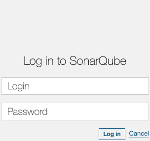
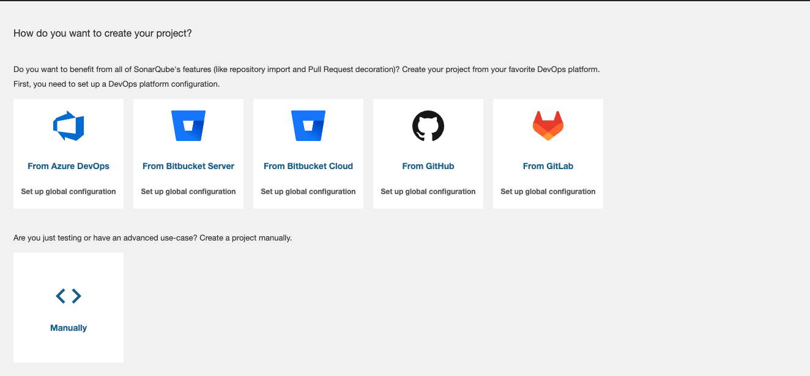
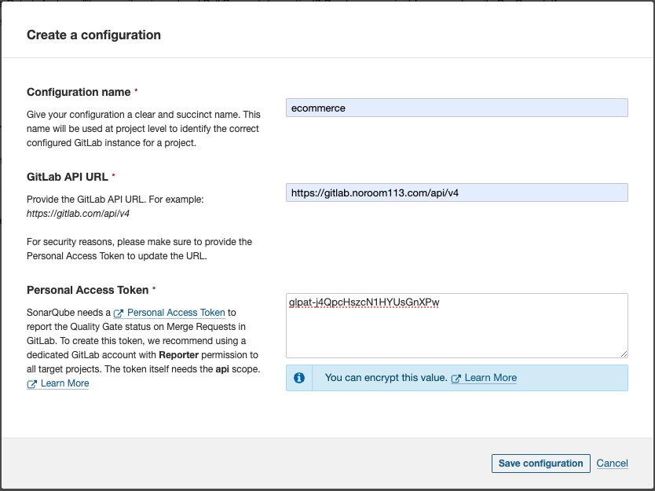

# Tên đề tài: Nghiên cứu về DevOps và xây dựng hệ thống CI/CD cho dự án thực tế

## Lời cảm ơn

Trong quá trình học tập, nghiên cứu và thực hiện đồ án, em đã nhận được sự giúp đỡ, góp ý và chỉ bảo nhiệt tình từ thầy cô, gia đình và bạn bè. Em xin bày tỏ lòng biết ơn sâu sắc và chân thành nhất.

Trước hết, em xin gửi lời cảm ơn đến thầy Đặng Ngọc Hùng, người đã tận tình hướng dẫn, chỉ bảo và truyền đạt kiến thức cũng như kinh nghiệm quý báu cho em trong suốt quá trình thực hiện đồ án.

Em cũng xin chân thành cảm ơn quý thầy cô trong trường, đặc biệt là các thầy cô trong Khoa Công nghệ thông tin, đã truyền đạt cho em những kiến thức về các môn đại cương và chuyên ngành, giúp em có nền tảng lý thuyết vững chắc và tạo điều kiện thuận lợi cho em trong suốt quá trình học tập.

Cuối cùng, em xin gửi lời cảm ơn đến gia đình và bạn bè đã luôn động viên, quan tâm và hỗ trợ em trong suốt quá trình học tập và thực hiện đồ án tốt nghiệp này.

Em xin chân thành cảm ơn!

## Mục lục

[Danh Sách Các Hình Ảnh](#danh-sách-các-hình-ảnh)

[Danh Mục Thuật Ngữ Và Các Từ Viết Tắt](#danh-mục-thuật-ngữ-và-các-từ-viết-tắt)

[Lời Nói Đầu](#lời-nói-đầu)

1. [Chương 1: Tổng quan về DevOps và CI/CD](#chương-1-tổng-quan-về-devops-và-cicd)
   - [1.1. DevOps là gì? Và lý do cần DevOps?](#11-devops-là-gì-và-lý-do-cần-devops)
   - [1.2. Sự hình thành và phát triển của DevOps](#12-sự-hình-thành-và-phát-triển-của-devops)
   - [1.3. Vai Trò của DevOps trong Từng Giai Đoạn Phát Triển Phần Mềm](#13-vai-trò-của-devops-trong-từng-giai-đoạn-phát-triển-phần-mềm)
   - [1.4. Khái niệm, vai trò và các nguyên tắc cơ bản của CI/CD trong DevOps](#14-khái-niệm-vai-trò-và-các-nguyên-tắc-cơ-bản-của-cicd-trong-devops)
   - [1.5. Lợi ích của việc áp dụng CI/CD](#15-lợi-ích-của-việc-áp-dụng-cicd)
   - [1.6. Pipeline trong CI/CD](#16-pipeline-trong-cicd)
   - [1.7. GitOps](#17-gitops)
   - [1.8. Branching Strategy](#18-branching-strategy)
2. [Chương 2: Công cụ và hệ sinh thái trong CI/CD](#chương-2-công-cụ-và-hệ-sinh-thái-trong-cicd)
   - [2.1. Tổng quan các công cụ CI/CD phổ biến](#21-tổng-quan-các-công-cụ-cicd-phổ-biến)
   - [2.2. Hệ sinh thái CI/CD](#22-hệ-sinh-thái-cicd)
   - [2.3. Các công cụ được sử dụng trong CI/CD cho dự án Ecommerce](#23-các-công-cụ-được-sử-dụng-trong-cicd-cho-dự-án-ecommerce)
3. [Chương 3: Xây dựng hệ thống CI/CD cho dự án Ecommerce](#chương-3-xây-dựng-hệ-thống-cicd-cho-dự-án-ecommerce)
   - [3.1. Cấu hình hệ thống CI/CD](#31-cấu-hình-hệ-thống-cicd)
   - [3.2. Kiến trúc hệ thống](#32-kiến-trúc-hệ-thống)
   - [3.3. Xây dựng chiến lược branching trong CI/CD](#33-xây-dựng-chiến-lược-branching-trong-cicd)
   - [3.4. Tích hợp CI/CD cho dự án Ecommerce](#34-tích-hợp-cicd-cho-dự-án-ecommerce)
   - [3.5. Quy trình Go-Live lên môi trường sản xuất](#35-quy-trình-go-live-lên-môi-trường-sản-xuất)
   - [3.6. Kịch bản vận hành hệ thống CI/CD](#36-kịch-bản-vận-hành-hệ-thống-cicd)
4. [Chương 4: Kết luận](#chương-4-kết-luận)

## Danh Sách Các Hình Ảnh

todo

## Danh Mục Thuật Ngữ Và Các Từ Viết Tắt

### Bảng thuật ngữ

| Thuật ngữ | Giải thích |
|-----------|------------|
| Container | Một đơn vị phần mềm tiêu chuẩn đóng gói mã nguồn và tất cả các phụ thuộc của nó để ứng dụng chạy nhanh và đáng tin cậy từ môi trường máy tính này sang môi trường máy tính khác |
| Pipeline | Một chuỗi các quy trình tự động được định nghĩa trước để đưa phần mềm qua các giai đoạn khác nhau từ phát triển đến triển khai |
| Repository | Kho lưu trữ mã nguồn, nơi lưu trữ tất cả các tệp tin của dự án cùng với lịch sử thay đổi của chúng |
| Microservices | Kiến trúc phần mềm trong đó các ứng dụng được xây dựng dưới dạng một tập hợp các dịch vụ nhỏ, độc lập |
| Branching Strategy | Chiến lược quản lý các nhánh trong hệ thống kiểm soát phiên bản, xác định cách tổ chức và quản lý mã nguồn |
| Deployment | Quá trình đưa ứng dụng vào hoạt động trên một môi trường cụ thể |
| Rollback | Quá trình quay trở lại phiên bản trước đó của phần mềm khi phát hiện lỗi trong phiên bản mới |
| Infrastructure as Code | Phương pháp quản lý và cung cấp cơ sở hạ tầng CNTT thông qua mã nguồn thay vì quy trình thủ công |
| Containerization | Quá trình đóng gói phần mềm và tất cả các thành phần cần thiết của nó vào một container |
| Orchestration | Quá trình tự động hóa việc triển khai, quản lý, mở rộng và kết nối các container |
| Artifact | Sản phẩm được tạo ra trong quá trình xây dựng phần mềm như file thực thi, thư viện, tài liệu |
| Blue-Green Deployment | Chiến lược triển khai sử dụng hai môi trường giống hệt nhau, một đang chạy và một dự phòng |
| Canary Deployment | Phương pháp triển khai từng phần nhỏ của ứng dụng cho một nhóm người dùng nhất định trước khi triển khai toàn bộ |
| Feature Toggle | Kỹ thuật cho phép bật/tắt các tính năng trong ứng dụng mà không cần triển khai lại |
| GitOps | Phương pháp vận hành và triển khai ứng dụng sử dụng Git làm nguồn sự thật duy nhất |
| Hot Fix | Sửa lỗi khẩn cấp được áp dụng trực tiếp lên môi trường sản xuất |
| Load Balancing | Phân phối tải công việc đồng đều giữa nhiều máy chủ để tối ưu hóa hiệu suất |
| Monitoring | Theo dõi và giám sát hiệu suất hệ thống để phát hiện và xử lý sự cố |
| Service Mesh | Lớp cơ sở hạ tầng dịch vụ để quản lý giao tiếp giữa các microservice |
| Zero Downtime Deployment | Triển khai ứng dụng mà không làm gián đoạn dịch vụ |

### Bảng viết tắt

| Viết tắt | Ý nghĩa |
|----------|----------|
| CI | Continuous Integration (Tích hợp liên tục) |
| CD | Continuous Delivery/Deployment (Phân phối/Triển khai liên tục) |
| DevOps | Development and Operations (Phát triển và Vận hành) |
| K8s | Kubernetes |
| VM | Virtual Machine (Máy ảo) |
| IaC | Infrastructure as Code (Cơ sở hạ tầng dưới dạng mã) |
| VCS | Version Control System (Hệ thống kiểm soát phiên bản) |
| API | Application Programming Interface (Giao diện lập trình ứng dụng) |
| DNS | Domain Name System (Hệ thống tên miền) |
| SSL/TLS | Secure Sockets Layer/Transport Layer Security (Giao thức bảo mật) |
| UI/UX | User Interface/User Experience (Giao diện người dùng/Trải nghiệm người dùng) |
| QA/QC | Quality Assurance/Quality Control (Đảm bảo chất lượng/Kiểm soát chất lượng) |
| UAT | User Acceptance Testing (Kiểm thử chấp nhận người dùng) |
| CNI | Container Network Interface (Giao diện mạng container) |
| NFS | Network File System (Hệ thống tập tin mạng) |
| YAML | YAML Ain't Markup Language (Ngôn ngữ đánh dấu YAML) |
| SRE | Site Reliability Engineering (Kỹ thuật độ tin cậy hệ thống) |
| SLA | Service Level Agreement (Thỏa thuận mức độ dịch vụ) |
| SLO | Service Level Objective (Mục tiêu mức độ dịch vụ) |
| SLI | Service Level Indicator (Chỉ số mức độ dịch vụ) |
| RBAC | Role-Based Access Control (Kiểm soát truy cập dựa trên vai trò) |
| JWT | JSON Web Token (Mã thông báo web JSON) |
| OIDC | OpenID Connect (Giao thức xác thực OpenID) |
| POC | Proof of Concept (Chứng minh khái niệm) |
| ROI | Return on Investment (Lợi nhuận đầu tư) |

## Lời Nói Đầu

Với sự phát triển không ngừng của công nghệ hiện nay, thị trường tràn ngập các sản phẩm phần mềm mới. Sự đa dạng và quy mô ngày càng lớn của các sản phẩm này đặt ra nhiều thách thức cho các tổ chức doanh nghiệp, chẳng hạn như:

- Làm thế nào để nhanh chóng đưa sản phẩm ra thị trường nhằm giành lợi thế cạnh tranh mà vẫn đảm bảo chất lượng dịch vụ phần mềm?
- Làm thế nào để quản lý và mở rộng quy mô hệ thống với nhiều dịch vụ?
- Làm thế nào để tối ưu hóa việc sử dụng cơ sở hạ tầng?

Để giải quyết những vấn đề này, DevOps là giải pháp cần thiết. DevOps là một văn hóa làm việc mới, một thuật ngữ mới, mang đến hệ thống tự động hóa quá trình lập trình và chuyển giao phần mềm, được gọi là hệ thống CI/CD.
Đề tài "Nghiên cứu về DevOps và xây dựng hệ thống CI/CD" làm rõ các khái niệm và thuật ngữ mới này, đồng thời giới thiệu và trình bày một hệ thống CI/CD cơ bản. Nội dung đề tài được chia thành ba chương với tóm tắt như sau:

- Chương 1 giới thiệu các khái niệm về DevOps, CI/CD, các giai đoạn của DevOps trong quy trình phát triển phần mềm, các nguyên tắc và lợi ích mà nó mang lại. Ngoài ra, chương này cũng giới thiệu các phần mở rộng của DevOps như DevSecOps và GitOps.
- Chương 2 tập trung vào việc giới thiệu các công cụ được sử dụng để xây dựng hệ thống CI/CD trong đề tài. Chương này sẽ trình bày chi tiết về các khái niệm, đặc điểm và công dụng của từng công cụ.
- Chương 3 trình bày về cấu hình, kiến trúc, cách cài đặt một hệ thống CI/CD và áp dụng CI/CD pipeline cho một dự án cụ thể. Chương này cũng sẽ đưa ra các kịch bản vận hành hệ thống CI/CD.
Phần kết luận tổng kết các kết quả đạt được, những hạn chế của đề tài và đưa ra hướng phát triển để áp dụng vào thực tế cho các doanh nghiệp và trên môi trường sản xuất.

## Chương 1: Tổng quan về DevOps và CI/CD

### 1.1. DevOps là gì? Và lý do cần DevOps?

Thông thường vòng đời của một sản phẩm phần mềm gồm 2 giai đoạn chính: giai đoạn phát triển và giai đoạn vận hành. Giai đoạn phát triển bao gồm phần việc của Business Analyst, UI/UX Designer, Developer, QA/QC Engineer, v.v... Giai đoạn vận hành có sự tham gia của System Engineer, System Administrator, Operation Executive, Release Engineer, Database Administrator, Network Engineer, Security Engineer, v.v... Ở mỗi giai đoạn đều có những đội nhóm và công việc tách biệt. Sự tách biệt này càng phân hóa rõ ràng ở những công ty có quy mô từ trung bình trở lên. Mục tiêu của nhóm phát triển là phát triển các tính năng mới liên quan đến những thay đổi đối với môi trường hiện có. Điều đó có nghĩa là những thay đổi mới được đưa vào một môi trường mà trên thực tế một môi trường có tính ổn định có thể bị mất ổn định do những thay đổi được đưa ra điều này mâu thuẫn trực tiếp với mục tiêu của các nhóm vận hành. Sự mâu thuẫn này hình thành nên khái niệm Wall of confusion - Bức tường của sự hiểu lầm. Nó sẽ là rào cản kìm hãm sự phát triển phần mềm khiến cho nỗ lực làm việc của nhân viên cũng như chất lượng phần mềm ngày càng giảm sút.
Về mặt sản phẩm, với sự phát triển của công nghệ kéo theo sự bùng nổ về quy mô của các công ty cũng như sự đa dạng các sản phẩm công nghệ khiến cho quy mô của các hệ thống cũng mở rộng theo cấp số nhân. Từ một vài server, hệ thống có thể phát triển lên đến hàng chục, hàng trăm, hàng nghìn, hoặc thậm chí hàng triệu server (ví dụ như trường hợp của Google, Facebook). Đồng thời ngành phát triển phần mềm cũng dịch chuyển theo một hướng khác – microservices - một sản phẩm lớn được chia tách ra thành rất nhiều các service nhỏ, các service này liên kết với nhau tạo thành một sản phẩm hoàn chỉnh. Trước nhu cầu phát triển và cải tiến sản phẩm liên tục, những thách thức mới, những bài toán mới được đặt ra:

- Về mặt quy trình, hay là khía cạnh con người, làm thế nào để các bộ phận hợp tác thuận lợi hơn? Làm thế nào để quy trình làm việc được trơn tru, suôn sẻ hơn?
- Về mặt sản phẩm, làm thế nào để các service kết nối và giao tiếp với nhau theo những nguyên tắc hiệu quả, cũng như đảm bảo việc mở rộng quy mô được dễ dàng và êm ái hơn?
Khái niệm DevOps ra đời nhằm giải quyết những vấn đề này. DevOps giúp tối ưu hóa chu trình phát triển phần mềm, giúp sản phẩm phần mềm được cập nhật, phát hành nhanh và thường xuyên hơn.

Vậy **DevOps** là gì?

DevOps là một phương pháp phát triển phần mềm kết hợp giữa phát triển (Development) và vận hành (Operations). Mục tiêu của DevOps là cải thiện sự hợp tác và giao tiếp giữa các nhóm phát triển và vận hành, từ đó tăng tốc độ phát triển phần mềm, nâng cao chất lượng sản phẩm và giảm thiểu rủi ro trong quá trình triển khai.

DevOps không chỉ là một tập hợp các công cụ và quy trình, mà còn là một văn hóa làm việc mới, nơi mà các nhóm phát triển và vận hành cùng chia sẻ trách nhiệm và hợp tác chặt chẽ để đạt được mục tiêu chung. DevOps thúc đẩy việc tự động hóa các quy trình phát triển, kiểm thử và triển khai, giúp giảm thiểu các công việc thủ công và tăng cường hiệu quả làm việc.

Một số nguyên tắc cơ bản của DevOps bao gồm:

1. **Tự động hóa**: Tự động hóa các quy trình phát triển, kiểm thử và triển khai để giảm thiểu sai sót do con người và tăng tốc độ phát hành phần mềm.
2. **Liên tục cải tiến**: Luôn tìm kiếm các cơ hội để cải tiến quy trình và công nghệ, từ đó nâng cao chất lượng sản phẩm và hiệu quả làm việc.
3. **Hợp tác chặt chẽ**: Tăng cường sự hợp tác và giao tiếp giữa các nhóm phát triển và vận hành, giúp giảm thiểu xung đột và tăng cường hiệu quả làm việc.
4. **Phản hồi nhanh chóng**: Thu thập và phản hồi nhanh chóng các thông tin từ người dùng và hệ thống, từ đó cải tiến sản phẩm và quy trình một cách liên tục.
5. **Bảo mật tích hợp**: Tích hợp các biện pháp bảo mật vào toàn bộ vòng đời phát triển phần mềm, giúp đảm bảo an toàn và tuân thủ các quy định.

**DevOps** đã trở thành một yếu tố quan trọng trong việc phát triển phần mềm hiện đại, giúp các tổ chức tối ưu hóa quy trình phát triển, nâng cao chất lượng sản phẩm và đáp ứng nhanh chóng với nhu cầu của thị trường.

Lợi ích của **DevOps** nằm ở khả năng cải tiến và chuyển đổi quy trình phát triển và vận hành phần mềm từ mô hình truyền thống Waterfall (thác nước) sang mô hình CI/CD (phát triển liên tục) [1] [2]. Bên cạnh đó, **DevOps** còn mang lại một số lợi ích đáng kể khác như sau:

- Tốc độ: DevOps cho phép hoạt động với tốc độ nhanh và tần suất cao, từ đó cải thiện khả năng phục vụ khách hàng, linh hoạt thích nghi với sự thay đổi liên tục của thị trường và đạt được hiệu quả kinh doanh đáng kể. DevOps đóng vai trò là công cụ hỗ trợ cho các nhà phát triển và nhóm nghiệp vụ trong việc đạt được những mục tiêu này.
- Chuyển giao nhanh chóng: Tăng tần suất và nhịp độ phát hành là yếu tố cần thiết để cải thiện và nâng cấp sản phẩm một cách nhanh chóng. Việc phát hành các tính năng mới giúp khắc phục sự cố kỹ thuật nhanh hơn, đáp ứng nhu cầu khách hàng và tạo lợi thế cạnh tranh. Độ tin cậy: Mặc dù tốc độ chuyển giao được đẩy nhanh, DevOps vẫn đảm bảo độ tin cậy và chất lượng của sản phẩm cũng như trải nghiệm người dùng cuối thông qua việc áp dụng CI/CD, giám sát và ghi nhật ký.
- Khả năng mở rộng: Nhờ vào tự động hóa và tính nhất quán, DevOps giúp quản lý hiệu quả các hệ thống phức tạp hoặc thường xuyên thay đổi với mức rủi ro thấp nhất.
- Cải thiện khả năng cộng tác: DevOps xây dựng các nhóm làm việc hiệu quả hơn bằng cách nhấn mạnh vào giá trị của sự tự chủ và trách nhiệm đối với công việc. Các nhà phát triển và nhóm nghiệp vụ hợp tác chặt chẽ, chia sẻ trách nhiệm và phối hợp thực hiện các quy trình công việc, từ đó giảm thiểu sự chậm trễ và tiết kiệm thời gian.
- Bảo mật: DevOps tăng tốc quá trình mà không ảnh hưởng đến tính bảo mật nhờ vào các chính sách tuân thủ tự động hóa, công cụ kiểm soát và kỹ thuật quản lý.

### 1.2. Sự hình thành và phát triển của DevOps

Các đề xuất kết hợp các phương pháp phát triển phần mềm với các khái niệm triển khai và vận hành đã bắt đầu xuất hiện vào cuối những năm 1980 và đầu những năm 1990. Trong giai đoạn này, các tổ chức đã nhận ra rằng việc phát triển phần mềm và triển khai vận hành thường được thực hiện bởi các nhóm riêng biệt, dẫn đến sự thiếu hiệu quả và nhiều vấn đề trong việc phối hợp. Đến khoảng năm 2007 và 2008, các cộng đồng phát triển phần mềm và công nghệ thông tin đã bắt đầu bày tỏ mối lo ngại về sự tách biệt này. Họ nhận thấy rằng việc một bên chỉ tập trung vào việc viết và tạo ra phần mềm mà không có sự liên kết chặt chẽ với những người chịu trách nhiệm triển khai và hỗ trợ phần mềm đã tạo ra một mức độ rối loạn chức năng nghiêm trọng trong ngành công nghiệp phần mềm.

Năm 2009, hội nghị đầu tiên mang tên DevOps Days được tổ chức tại Ghent, Bỉ. Hội nghị này được sáng lập bởi Patrick Debois, một nhà tư vấn người Bỉ, người đã có nhiều kinh nghiệm trong quản lý dự án và thực hành Agile. Hội nghị DevOps Days đã nhanh chóng lan rộng ra các quốc gia khác, trở thành một diễn đàn quan trọng để các chuyên gia chia sẻ kinh nghiệm và thảo luận về các phương pháp tốt nhất trong việc kết hợp phát triển và vận hành phần mềm.

Năm 2012, một báo cáo có tên "State of DevOps" lần đầu tiên được xuất bản bởi Alanna Brown tại Puppet Labs. Báo cáo này đã cung cấp một cái nhìn sâu sắc về tình trạng và xu hướng của DevOps trong ngành công nghiệp phần mềm. Từ năm 2014, báo cáo thường niên State of DevOps được xuất bản bởi Nicole Forsgren, Gene Kim, Jez Humble và những người khác, đã chỉ ra rằng việc áp dụng DevOps đang gia tăng nhanh chóng. Cũng trong năm 2014, Lisa Crispin và Janet Gregory đã viết cuốn sách "More Agile Testing", trong đó có một chương đặc biệt về kiểm thử và DevOps, nhấn mạnh tầm quan trọng của việc tích hợp kiểm thử vào quy trình DevOps.

Năm 2016, các chỉ số DORA (DevOps Research and Assessment) về thông lượng và độ ổn định đã được công bố trong báo cáo State of DevOps. Các chỉ số này bao gồm tần suất triển khai, thời gian dẫn cho các thay đổi, thời gian trung bình để phục hồi và tỷ lệ thất bại thay đổi. Tuy nhiên, phương pháp nghiên cứu và các chỉ số này đã bị chỉ trích bởi một số chuyên gia trong ngành. Để đáp lại những chỉ trích này, báo cáo State of DevOps năm 2023 đã công bố những thay đổi cập nhật, đặc biệt là việc điều chỉnh chỉ số độ ổn định từ "thời gian trung bình để phục hồi" thành "thời gian phục hồi triển khai thất bại", nhằm thừa nhận và giải quyết sự nhầm lẫn mà chỉ số trước đó đã gây ra.

Sự hội tụ của các phong trào quản lý và công nghệ này đã tạo nên nền tảng vững chắc cho sự hình thành và phát triển của DevOps. DevOps không chỉ là một tập hợp các công cụ và quy trình, mà còn là một triết lý và văn hóa làm việc mới, nơi mà sự hợp tác và tự động hóa được đặt lên hàng đầu để tối ưu hóa quy trình phát triển phần mềm.

### 1.3. Vai Trò của DevOps trong Từng Giai Đoạn Phát Triển Phần Mềm

DevOps đóng vai trò quan trọng và không thể thiếu trong từng giai đoạn của vòng đời phát triển phần mềm, bao gồm: Lên Kế Hoạch, Lập Trình, Xây Dựng, Kiểm Thử, Phát Hành, Triển Khai, Vận Hành, và Giám Sát. Mỗi giai đoạn đều có những yêu cầu và thách thức riêng, và DevOps Engineer là người đảm bảo rằng các quy trình và công cụ được tích hợp một cách hiệu quả để tối ưu hóa sự phát triển và vận hành phần mềm.

Trong giai đoạn Lên Kế Hoạch, DevOps Engineer tham gia vào việc xác định kiến trúc ứng dụng và các yêu cầu cơ sở hạ tầng. Họ cần phân tích và xác định các thành phần phần mềm cần thiết, luồng hoạt động của hệ thống, và các yêu cầu cơ sở hạ tầng cần thiết để hỗ trợ ứng dụng. Điều này đòi hỏi một sự hiểu biết sâu sắc về cách các thành phần phần mềm tương tác với nhau và cách chúng sẽ được triển khai trên cơ sở hạ tầng hiện có. DevOps Engineer cũng cần xác định các phụ thuộc, tức là các công nghệ và công cụ cần thiết để phát triển và duy trì hạ tầng. Điều này bao gồm việc đánh giá khả năng duy trì và mở rộng của các công nghệ hiện tại, cũng như khả năng tích hợp với các công nghệ mới. Họ cũng cần đánh giá kích thước của dự án, tức là xác định tài nguyên cần thiết để quản trị hạ tầng một cách hợp lý và hiệu quả, đảm bảo rằng hệ thống có thể đáp ứng được nhu cầu hiện tại và tương lai. Ngoài ra, DevOps Engineer cũng thiết lập các nguyên tắc và hướng dẫn chi tiết cho đội ngũ phát triển. Điều này bao gồm việc tổ chức nhánh git một cách khoa học và phân chia môi trường cho hệ thống CI, đảm bảo rằng các thay đổi mã nguồn được quản lý và tích hợp một cách hiệu quả. Họ cũng cần định vị và cấu hình ứng dụng một cách chính xác, đảm bảo rằng các cấu hình này phù hợp với môi trường triển khai.

Trong giai đoạn Lập Trình, DevOps Engineer không chỉ hỗ trợ quản lý kho git mà còn tham gia vào việc đánh giá mã nguồn, đảm bảo rằng mã nguồn được viết theo các tiêu chuẩn và thực hành tốt nhất, giúp giảm thiểu lỗi và cải thiện chất lượng phần mềm. Họ cũng có thể tham gia vào việc thiết lập các công cụ kiểm thử tự động, giúp phát hiện sớm các lỗi và vấn đề bảo mật trong mã nguồn.

Giai đoạn Xây Dựng là một phần quan trọng trong quy trình DevOps, nơi DevOps Engineer tập trung vào việc sử dụng các công cụ như Docker để đóng gói ứng dụng dưới dạng container. Việc này không chỉ giúp chuẩn hóa môi trường triển khai mà còn hỗ trợ tự động hóa quy trình CI với các công cụ như GitLab CI, Jenkins, Circle CI. Tối ưu hóa Dockerfile là một nhiệm vụ quan trọng, có thể giúp giảm thời gian xây dựng, giảm kích thước image, và tăng cường bảo mật cho ứng dụng. DevOps Engineer cũng cần đảm bảo rằng các bản build được thực hiện một cách nhất quán và có thể tái tạo, giúp giảm thiểu rủi ro khi triển khai.

Trong giai đoạn Kiểm Thử, DevOps Engineer có thể tham gia vào việc viết các test case đơn giản và chuẩn bị môi trường kiểm thử, đảm bảo rằng các tính năng mới được kiểm thử đầy đủ trước khi triển khai. Họ cũng có thể thiết lập các công cụ kiểm thử tự động để đảm bảo rằng các bài kiểm thử được thực hiện một cách nhất quán và hiệu quả.

Giai đoạn Phát Hành là khi phần mềm được chuyển giao từ đội ngũ phát triển sang vận hành. DevOps Engineer cần yêu cầu viết Release note chi tiết để theo dõi các thay đổi và đánh giá rủi ro, cũng như lập kế hoạch migrate và rollback nếu cần thiết, đảm bảo rằng quá trình phát hành diễn ra suôn sẻ và không gây ra gián đoạn cho người dùng. Họ cũng cần đảm bảo rằng các bản phát hành được thực hiện một cách nhất quán và có thể tái tạo, giúp giảm thiểu rủi ro khi triển khai.

Giai đoạn Triển Khai liên quan đến việc chuẩn bị môi trường và tự động hóa quy trình triển khai qua hệ thống CD, đảm bảo rằng phần mềm được triển khai một cách nhất quán và đáng tin cậy. DevOps Engineer cần đảm bảo rằng các bản triển khai được thực hiện một cách nhất quán và có thể tái tạo, giúp giảm thiểu rủi ro khi triển khai.

Trong giai đoạn Vận Hành, DevOps Engineer cung cấp các công cụ và hệ thống để phát hiện và sửa lỗi nhanh chóng. Điều này bao gồm việc thiết lập hệ thống log tập trung để thu thập và phân tích dữ liệu log, giám sát tài nguyên để đảm bảo rằng hệ thống hoạt động hiệu quả, và sử dụng bảng điều khiển CI/CD để theo dõi và quản lý các quy trình triển khai. Họ cũng cần tích hợp các công cụ truy vết lỗi và hệ thống thông báo sự cố để nhanh chóng phát hiện và khắc phục các vấn đề, đảm bảo rằng hệ thống luôn hoạt động ổn định và đáp ứng được nhu cầu của người dùng.

Cuối cùng, giai đoạn Giám Sát yêu cầu DevOps Engineer và đội ngũ quản trị giám sát toàn bộ hệ thống, lập kế hoạch mở rộng, đánh giá rủi ro, và triển khai hệ thống giám sát/cảnh báo khi có sự cố. DevOps Engineer cần đảm bảo rằng hệ thống giám sát được thiết lập một cách nhất quán và có thể tái tạo, giúp giảm thiểu rủi ro khi triển khai.

### DevSecOps

#### DevSecOps là gì?

DevSecOps là một phương pháp phát triển phần mềm kết hợp ba yếu tố chính: phát triển (Development), vận hành (Operations) và bảo mật (Security). Mục tiêu của DevSecOps là tích hợp bảo mật vào toàn bộ vòng đời phát triển phần mềm, từ giai đoạn thiết kế cho đến triển khai và bảo trì. Điều này có nghĩa là bảo mật không chỉ được xem xét ở giai đoạn cuối mà phải được tích hợp ngay từ đầu, giúp nhận diện và khắc phục các lỗ hổng bảo mật một cách sớm nhất.

#### Lợi ích của DevSecOps

1. **Tích hợp Bảo mật Sớm**: DevSecOps cho phép phát hiện và xử lý các vấn đề bảo mật ngay từ giai đoạn đầu của phát triển, từ đó giảm thiểu rủi ro khi triển khai.

2. **Tăng cường Hiệu suất**: Sự hợp tác chặt chẽ giữa các nhóm phát triển, vận hành và bảo mật giúp tăng tốc độ phát triển và giảm thời gian phát hành sản phẩm.

3. **Giảm Chi phí**: Việc phát hiện sớm các lỗ hổng bảo mật giúp tiết kiệm chi phí khắc phục sau này, tránh việc phải xử lý các vấn đề nghiêm trọng sau khi sản phẩm đã được phát hành.

4. **Cải thiện Độ Tin cậy**: Khi bảo mật được tích hợp vào quy trình phát triển, sản phẩm cuối cùng sẽ đáng tin cậy hơn và có độ an toàn cao hơn.

5. **Nâng cao Nhận thức Bảo mật**: DevSecOps khuyến khích đội ngũ phát triển và vận hành nâng cao nhận thức về bảo mật, từ đó góp phần xây dựng văn hóa bảo mật trong tổ chức.

### 1.4. Khái niệm, vai trò và các nguyên tắc cơ bản của CI/CD trong DevOps

Ở phần trước chúng ta đã tìm hiểu về DevOps và có đề cập tới CI/CD. DevOps ra đời mang theo một mô hình phát triển phần mềm mới đó là hệ thống tự động hóa CI/CD. Có thể nói CI/CD chính là trái tim của DevOps. Trong chương này ta sẽ tìm hiểu hệ thống CI/CD là gì? CI/CD pipeline là gì? Cách thức triển khai một hệ thống CI/CD hoàn chỉnh.

#### Khái niệm CI/CD

CI (Continuous Integration) - Tích hợp liên tục, là quá trình tự động hóa việc tích hợp mã nguồn từ các thành viên trong nhóm phát triển vào một kho lưu trữ mã nguồn (như Git) một cách sớm và thường xuyên. Mỗi khi có thay đổi về mã nguồn, mã sẽ được tự động kiểm thử thông qua các quy tỉtrình xác thực. Thông thường, quy trình bắt đầu bằng việc phân tích mã tĩnh để xác minh chất lượng mã. Sau khi mã vượt qua các bài kiểm thử tĩnh, quy trình CI tự động sẽ đóng gói và biên dịch mã để kiểm thử động. Quy trình CI cần có hệ thống kiểm soát phiên bản để theo dõi các thay đổi và biết phiên bản mã được sử dụng.
Mục tiêu của CI là đảm bảo rằng mã nguồn mới được thêm vào dự án không gây ra lỗi tích hợp và không ảnh hưởng đến công việc của các thành viên khác. Với tích hợp liên tục, các lỗi và vấn đề bảo mật có thể được phát hiện và sửa chữa dễ dàng và sớm hơn trong quá trình phát triển.

Bằng cách hợp nhất các thay đổi thường xuyên và kích hoạt các quy trình kiểm thử và xác thực tự động, hệ thống CI giúp giảm thiểu khả năng xung đột mã, ngay cả khi có nhiều nhà phát triển làm việc trên cùng một ứng dụng. Một lợi ích lớn của hệ thống CI là rút ngắn thời gian chờ từ khi các nhà phát triển commit mã cho đến khi nhận được phản hồi đánh giá chất lượng mã nguồn từ các bộ phận khác và tiến hành thay đổi, sửa lỗi. Với CI, các nhà phát triển không phải đợi lâu để có kết quả đánh giá chất lượng mã nguồn, từ đó có thể sẵn sàng sửa các lỗi và vấn đề bảo mật sớm nhất có thể.
CD (Continuous Delivery/Continuous Deployment), thuật ngữ CD có hai nghĩa là Phân phối liên tục và Triển khai liên tục.
Phân phối liên tục đề cập đến việc tự động hóa quy trình cung cấp cơ sở hạ tầng và phát hành ứng dụng. Sau khi mã đã được kiểm thử và xây dựng, hệ thống Phân phối liên tục sẽ tiếp quản các giai đoạn cuối cùng để đảm bảo mã được đóng gói với mọi thứ cần thiết để triển khai trên mọi môi trường vào bất kỳ lúc nào. Phân phối liên tục có thể bao gồm mọi công đoạn từ việc cung cấp cơ sở hạ tầng đến việc phân phối ứng dụng tới các môi trường thử nghiệm hoặc sản xuất. Với Phân phối liên tục, phần mềm được xây dựng có thể triển khai vào môi trường sản xuất bất kỳ lúc nào. Việc triển khai có thể kích hoạt theo cách thủ công hoặc chuyển sang Triển khai liên tục, trong đó việc triển khai cũng được tự động hóa.

Triển khai liên tục là giai đoạn cuối của quá trình CI/CD. Triển khai liên tục là phần mở rộng của Phân phối liên tục, cho phép các tổ chức triển khai ứng dụng của họ một cách tự động, loại bỏ nhu cầu can thiệp của con người. Với việc triển khai liên tục, các nhóm DevOps đặt ra trước các tiêu chí cho việc phát hành mã và khi các tiêu chí đó được đáp ứng và xác thực, mã sẽ được triển khai vào môi trường sản xuất. Điều này cho phép các tổ chức hoạt động linh hoạt hơn và đưa các tính năng mới đến người dùng nhanh hơn.

Mặc dù có thể thực hiện CI mà không cần CD, nhưng thực sự không thể thực hiện CD nếu không có sẵn CI. Đó là bởi vì sẽ cực kỳ khó để có thể triển khai vào môi trường sản xuất bất cứ lúc nào nếu không thực hành các nguyên tắc cơ bản về CI như tích hợp mã vào kho lưu trữ chung, tự động hóa kiểm thử và xây dựng cũng như thực hiện tất cả các công việc đó theo từng đợt nhỏ hàng ngày. Thực tế, việc Triển khai liên tục sẽ không được khuyến khích áp dụng với môi trường sản xuất mà chỉ áp dụng với các môi trường phát triển, kiểm thử, UAT, staging, v.v... bởi môi trường sản xuất là quan trọng nhất, bước cuối cùng triển khai cần phải thực hiện thủ công, yêu cầu sự đánh giá và chấp thuận của cá nhân/tổ chức có thẩm quyền.

Với CI/CD, mỗi thay đổi mã nguồn của nhà phát triển đều có thể xuất hiện trên ứng dụng trong vài phút hoặc vài giờ (trong trường hợp mã nguồn vượt qua quá trình kiểm thử tự động). Điều này giúp việc liên tục nhận phản hồi dễ dàng hơn nhiều, từ đó việc thay đổi, sửa đổi, sửa lỗi diễn ra thường xuyên hơn. Kết hợp lại với nhau, tất cả các phương pháp CI/CD được kết nối này giúp việc triển khai ứng dụng ít rủi ro hơn, nhờ đó việc phát hành các thay đổi đối với ứng dụng theo từng phần nhỏ sẽ dễ dàng hơn thay vì tất cả cùng một lúc. Tuy nhiên, cũng cần phải đầu tư trước rất nhiều nỗ lực vì hệ thống tự động cần được xây dựng một cách phù hợp và đảm bảo vận hành trơn tru trong từng giai đoạn, từng trường hợp trong quy trình CI/CD.

#### Vai trò và nguyên tắc của CI/CD trong DevOps

### Tự động hóa (Automation)

Tự động hóa là yếu tố cốt lõi trong CI/CD. Nó giúp tự động hóa các quy trình xây dựng, kiểm thử và triển khai, từ đó giảm thiểu khả năng xảy ra lỗi do con người và tăng tốc độ phát triển phần mềm. Các công cụ CI/CD phổ biến như Jenkins, GitLab CI, và Travis CI được sử dụng để thiết lập và quản lý các quy trình tự động hóa này.

### Tích hợp thường xuyên (Frequent Integration)

Các nhà phát triển nên tích hợp mã của họ vào kho lưu trữ chung một cách thường xuyên, lý tưởng là nhiều lần trong một ngày. Việc tích hợp thường xuyên giúp phát hiện và giải quyết các xung đột ngay từ sớm, giảm thiểu rủi ro và đảm bảo rằng mã luôn ở trạng thái sẵn sàng để triển khai.

### Kiểm thử tự động (Automated Testing)

Kiểm thử tự động được thực hiện ở mọi giai đoạn của quy trình CI/CD nhằm đảm bảo chất lượng mã. Các loại kiểm thử bao gồm kiểm thử đơn vị, kiểm thử tích hợp, kiểm thử hệ thống và kiểm thử chấp nhận. Để tự động hóa các bài kiểm tra này, các công cụ như Selenium, JUnit, và pytest thường được sử dụng.

### Phản hồi liên tục (Continuous Feedback)

Các nhóm phát triển nhận được phản hồi liên tục về chất lượng mã thông qua các báo cáo kiểm tra tự động, thông báo lỗi và các chỉ số hiệu suất. Phản hồi nhanh chóng cho phép các nhà phát triển sử lỗi kịp thời và cải thiện chất lượng phần mềm một cách hiệu quả.

### Triển khai thường xuyên (Frequent Deployment)

Mục tiêu của CI/CD là triển khai phần mềm đến môi trường production một cách thường xuyên, lý tưởng là nhiều lần mỗi ngày hoặc mỗi tuần. Việc triển khai thường xuyên giúp mang lại giá trị cho khách hàng một cách nhanh chóng, giảm thiểu rủi ro và cho phép các tổ chức phản ứng nhanh chóng với nhu cầu thị trường.

### Môi trường giống Production (Production-Like Environments)

CI/CD yêu cầu sử dụng các môi trường giống production ở mọi giai đoạn của quy trình phát triển. Điều này đảm bảo rằng phần mềm hoạt động như mong đợi khi được triển khai. Các công nghệ container như Docker và Kubernetes thường được sử dụng để tạo ra các môi trường nhất quán và có thể tái tạo.

### Cải tiến liên tục (Continuous Improvement)

CI/CD là một quy trình lặp đi lặp lại, tập trung vào việc cải thiện liên tục các quy trình phát triển phần mềm. Các nhóm DevOps áp dụng các kỹ thuật như hồi cứu, phân tích nguyên nhân gốc rễ và thử nghiệm A/B để xác định các điểm cần cải thiện và thực hiện các thay đổi cần thiết.

### 1.5. Lợi ích của việc áp dụng CI/CD

CI/CD mang lại nhiều lợi ích quan trọng cho các tổ chức phát triển phần mềm, bao gồm:

1. **Tăng tốc độ phát triển và triển khai**: CI/CD giúp tự động hóa các quy trình phát triển và triển khai, giảm thiểu thời gian chờ đợi và tăng tốc độ phát hành phần mềm.

2. **Cải thiện chất lượng phần mềm**: Bằng cách thực hiện kiểm thử tự động và liên tục, CI/CD giúp phát hiện và khắc phục lỗi sớm, đảm bảo chất lượng phần mềm cao hơn.

3. **Giảm thiểu rủi ro**: CI/CD cho phép triển khai các thay đổi nhỏ và thường xuyên, giảm thiểu rủi ro so với việc triển khai các thay đổi lớn và không thường xuyên.

4. **Tăng cường sự hợp tác**: CI/CD thúc đẩy sự hợp tác giữa các nhóm phát triển, kiểm thử và vận hành, giúp cải thiện hiệu quả làm việc và giảm thiểu xung đột.

5. **Nâng cao khả năng phản ứng**: CI/CD cho phép các tổ chức phản ứng nhanh chóng với các yêu cầu thay đổi từ khách hàng hoặc thị trường, giúp duy trì sự cạnh tranh.

6. **Tối ưu hóa tài nguyên**: CI/CD giúp tối ưu hóa việc sử dụng tài nguyên bằng cách tự động hóa các quy trình và giảm thiểu lãng phí.

7. **Tăng cường bảo mật**: CI/CD tích hợp các biện pháp bảo mật vào quy trình phát triển và triển khai, giúp giảm thiểu rủi ro bảo mật và đảm bảo tuân thủ các quy định.

8. **Cải thiện trải nghiệm người dùng**: CI/CD giúp cung cấp các bản cập nhật và tính năng mới một cách nhanh chóng và liên tục, cải thiện trải nghiệm người dùng và tăng cường sự hài lòng của khách hàng.

### 1.6. Pipeline trong CI/CD

Pipeline trong CI/CD là một chuỗi các bước tự động hóa được thực hiện để xây dựng, kiểm thử và triển khai phần mềm. Pipeline giúp đảm bảo rằng mọi thay đổi trong mã nguồn đều được kiểm tra và triển khai một cách nhất quán và đáng tin cậy. Dưới đây là các thành phần chính của một pipeline trong CI/CD:

1. **Source Stage (Giai đoạn nguồn)**:
   - Đây là giai đoạn đầu tiên của pipeline, nơi mã nguồn được lấy từ kho lưu trữ (repository) như GitHub, GitLab, hoặc Bitbucket.
   - Mỗi khi có thay đổi trong mã nguồn (ví dụ: commit mới), pipeline sẽ được kích hoạt để bắt đầu quá trình tự động hóa.

2. **Build Stage (Giai đoạn xây dựng)**:
   - Trong giai đoạn này, mã nguồn được biên dịch và xây dựng thành các gói phần mềm hoặc container.
   - Các công cụ như Maven, Gradle, hoặc Docker thường được sử dụng để thực hiện quá trình này.
   - Giai đoạn này giúp đảm bảo rằng mã nguồn có thể được biên dịch và xây dựng thành công mà không gặp lỗi.

3. **Test Stage (Giai đoạn kiểm thử)**:
   - Giai đoạn kiểm thử bao gồm việc chạy các bài kiểm thử tự động để đảm bảo chất lượng mã.
   - Các loại kiểm thử có thể bao gồm kiểm thử đơn vị (unit tests), kiểm thử tích hợp (integration tests), và kiểm thử hệ thống (system tests).
   - Các công cụ như JUnit, Selenium, và pytest thường được sử dụng để thực hiện các bài kiểm thử này.

4. **Deploy Stage (Giai đoạn triển khai)**:
   - Sau khi mã đã được kiểm thử và xác nhận là không có lỗi, nó sẽ được triển khai đến các môi trường khác nhau như staging, UAT (User Acceptance Testing), và production.
   - Quá trình triển khai có thể bao gồm việc sao chép các tệp tin, cấu hình các dịch vụ, và khởi động lại các ứng dụng.
   - Các công cụ như Ansible, Chef, và Kubernetes thường được sử dụng để tự động hóa quá trình triển khai.

5. **Monitor Stage (Giai đoạn giám sát)**:
   - Giai đoạn giám sát bao gồm việc theo dõi và giám sát các ứng dụng đã triển khai để đảm bảo rằng chúng hoạt động đúng cách.
   - Các công cụ giám sát như Prometheus, Grafana, và ELK stack (Elasticsearch, Logstash, Kibana) thường được sử dụng để thu thập và phân tích dữ liệu giám sát.
   - Giai đoạn này giúp phát hiện sớm các vấn đề và đảm bảo rằng ứng dụng luôn ở trạng thái sẵn sàng.

Pipeline trong CI/CD giúp tối ưu hóa quy trình phát triển phần mềm bằng cách tự động hóa các bước quan trọng và đảm bảo rằng mọi thay đổi đều được kiểm tra và triển khai một cách nhất quán. Điều này giúp giảm thiểu rủi ro, tăng tốc độ phát triển và cải thiện chất lượng phần mềm.

### 1.7. GitOps

GitOps là một phương pháp quản lý cơ sở hạ tầng và ứng dụng bằng cách sử dụng Git như một nguồn sự thật duy nhất. GitOps tận dụng các công cụ và quy trình CI/CD để tự động hóa việc triển khai và quản lý hệ thống. Dưới đây là một số lợi ích chính của GitOps:

1. **Quản lý phiên bản**: GitOps cho phép quản lý phiên bản của toàn bộ cơ sở hạ tầng và ứng dụng. Mọi thay đổi đều được ghi lại trong lịch sử commit của Git, giúp dễ dàng theo dõi và quay lại phiên bản trước nếu cần.

2. **Tự động hóa triển khai**: GitOps tự động hóa quy trình triển khai bằng cách sử dụng các công cụ CI/CD để áp dụng các thay đổi từ Git vào môi trường thực tế. Điều này giúp giảm thiểu sai sót do con người và tăng tốc độ phát hành phần mềm.

3. **Tăng cường bảo mật**: GitOps đảm bảo rằng chỉ những thay đổi đã được phê duyệt mới được triển khai, từ đó nâng cao tính bảo mật cho hệ thống. Mọi thay đổi đều phải thông qua quy trình kiểm tra và phê duyệt trước khi được áp dụng.

4. **Khả năng khôi phục nhanh chóng**: Trong trường hợp xảy ra sự cố, GitOps cho phép khôi phục nhanh chóng về trạng thái trước đó bằng cách sử dụng các commit trong Git. Điều này giúp giảm thiểu thời gian ngừng hoạt động và đảm bảo tính liên tục của dịch vụ.

5. **Cải thiện khả năng hợp tác**: GitOps khuyến khích sự hợp tác giữa các nhóm phát triển và vận hành. Mọi thay đổi đều được thực hiện thông qua quy trình Git, giúp mọi người dễ dàng theo dõi và hiểu rõ các thay đổi trong hệ thống.

6. **Tính nhất quán và đáng tin cậy**: GitOps đảm bảo rằng mọi thay đổi đều được áp dụng một cách nhất quán và đáng tin cậy. Các công cụ CI/CD sẽ tự động kiểm tra và triển khai các thay đổi, giúp giảm thiểu rủi ro và đảm bảo tính ổn định của hệ thống.

GitOps là một phương pháp mạnh mẽ giúp tối ưu hóa quy trình quản lý cơ sở hạ tầng và ứng dụng. Bằng cách sử dụng Git như một nguồn sự thật duy nhất và tự động hóa quy trình triển khai, GitOps giúp cải thiện tính bảo mật, khả năng khôi phục, và khả năng hợp tác giữa các nhóm.

### 1.8. Branching Strategy

Branching Strategy (Chiến lược phân nhánh) là một phần quan trọng trong quy trình phát triển phần mềm, đặc biệt khi áp dụng các phương pháp GitOps, DevOps và CI/CD. Chiến lược phân nhánh giúp quản lý và tổ chức mã nguồn một cách hiệu quả, đảm bảo rằng các thay đổi được kiểm tra và triển khai một cách nhất quán và an toàn.

Một số chiến lược phân nhánh phổ biến bao gồm:

1. **Feature Branching**: Mỗi tính năng mới được phát triển trên một nhánh riêng biệt. Khi tính năng hoàn thành và được kiểm tra, nhánh này sẽ được hợp nhất vào nhánh chính (main hoặc master).

2. **Release Branching**: Khi chuẩn bị phát hành một phiên bản mới, một nhánh phát hành được tạo ra từ nhánh chính. Nhánh này sẽ chỉ chứa các thay đổi liên quan đến phiên bản sắp phát hành và không bao gồm các tính năng mới đang phát triển.

3. **Hotfix Branching**: Khi cần sửa lỗi khẩn cấp trong phiên bản đang chạy, một nhánh hotfix được tạo ra từ nhánh chính hoặc nhánh phát hành. Sau khi lỗi được sửa, nhánh hotfix sẽ được hợp nhất trở lại vào nhánh chính và nhánh phát hành.

4. **GitFlow**: Là một chiến lược phân nhánh phức tạp hơn, bao gồm các nhánh chính, nhánh phát triển, nhánh tính năng, nhánh phát hành và nhánh hotfix. GitFlow giúp quản lý quy trình phát triển phần mềm một cách rõ ràng và có cấu trúc.

5. **Trunk-Based Development**: Tất cả các thay đổi được thực hiện trực tiếp trên nhánh chính. Các nhánh ngắn hạn có thể được tạo ra cho các tính năng hoặc sửa lỗi, nhưng chúng sẽ được hợp nhất trở lại vào nhánh chính càng sớm càng tốt.

Chiến lược phân nhánh phù hợp sẽ giúp tối ưu hóa quy trình phát triển phần mềm, giảm thiểu xung đột mã nguồn và đảm bảo rằng các thay đổi được triển khai một cách nhất quán và an toàn.

## Chương 2: Công cụ và hệ sinh thái trong CI/CD

### 2.1. Tổng quan các công cụ CI/CD phổ biến

Trong phần này, chúng ta sẽ điểm qua những công cụ CI/CD phổ biến nhất hiện nay, giúp bạn hiểu rõ hơn về các lựa chọn có sẵn. Dưới đây là một số công cụ nổi bật:

1. **Jenkins**:
   - Là một trong những công cụ CI/CD lâu đời và được sử dụng rộng rãi.
   - Hỗ trợ nhiều plugin cho phép tích hợp với nhiều công nghệ khác nhau.
   - Cung cấp khả năng tùy chỉnh cao và có thể mở rộng dễ dàng.

2. **GitLab CI/CD**:
   - Tích hợp trực tiếp với GitLab, giúp quản lý mã nguồn và quy trình CI/CD trong cùng một nền tảng.
   - Cung cấp giao diện người dùng thân thiện và dễ sử dụng.
   - Hỗ trợ tự động hóa quy trình kiểm tra và triển khai.

3. **CircleCI**:
   - Nổi bật với khả năng tích hợp dễ dàng và tốc độ triển khai nhanh.
   - Cung cấp các tùy chọn cấu hình linh hoạt thông qua file cấu hình YAML.
   - Hỗ trợ nhiều ngôn ngữ lập trình và môi trường khác nhau.

4. **TravisCI**:
   - Thích hợp cho các dự án mã nguồn mở và có khả năng tích hợp tốt với GitHub.
   - Cung cấp khả năng kiểm tra tự động cho các pull request.
   - Dễ dàng cấu hình và sử dụng cho các dự án nhỏ.

5. **Bamboo**:
   - Là một sản phẩm của Atlassian, tích hợp tốt với các công cụ khác như JIRA và Bitbucket.
   - Cung cấp khả năng theo dõi và quản lý quy trình phát triển một cách hiệu quả.
   - Hỗ trợ các quy trình CI/CD phức tạp với nhiều môi trường khác nhau.

### GitLab CI/CD: Tính năng và ứng dụng thực tế

GitLab CI/CD là một công cụ mạnh mẽ giúp tự động hóa quy trình phát triển phần mềm. Dưới đây là một số tính năng nổi bật của GitLab CI/CD:

1. **Tích hợp liền mạch**: GitLab CI/CD được tích hợp trực tiếp vào GitLab, cho phép người dùng dễ dàng quản lý mã nguồn và quy trình CI/CD trong cùng một nền tảng. Điều này giúp giảm thiểu sự phức tạp khi sử dụng nhiều công cụ khác nhau.

2. **Giao diện người dùng thân thiện**: Giao diện của GitLab CI/CD rất dễ sử dụng, giúp người dùng dễ dàng cấu hình và theo dõi quy trình CI/CD mà không cần nhiều kiến thức kỹ thuật.

3. **Hỗ trợ nhiều ngôn ngữ lập trình**: GitLab CI/CD hỗ trợ nhiều ngôn ngữ lập trình khác nhau, từ Java, Python đến Ruby, giúp các nhóm phát triển có thể sử dụng công cụ này cho nhiều dự án khác nhau.

4. **Tính năng kiểm tra tự động**: GitLab CI/CD cho phép thiết lập các quy trình kiểm tra tự động cho mã nguồn, giúp phát hiện lỗi sớm và đảm bảo chất lượng sản phẩm.

5. **Quản lý môi trường triển khai**: GitLab CI/CD cung cấp khả năng quản lý các môi trường triển khai khác nhau, cho phép người dùng dễ dàng triển khai ứng dụng lên các môi trường như staging, production.

### Ứng dụng thực tế của GitLab CI/CD

GitLab CI/CD đã được áp dụng thành công trong nhiều dự án thực tế. Một số ví dụ điển hình bao gồm:

- **Dự án mã nguồn mở**: Nhiều dự án mã nguồn mở đã sử dụng GitLab CI/CD để tự động hóa quy trình kiểm tra và triển khai, giúp tăng cường sự hợp tác giữa các nhà phát triển.

- **Doanh nghiệp**: Nhiều công ty lớn đã tích hợp GitLab CI/CD vào quy trình phát triển phần mềm của họ, giúp cải thiện hiệu suất và giảm thiểu thời gian phát hành sản phẩm.

- **Khởi nghiệp**: Các công ty khởi nghiệp cũng đã áp dụng GitLab CI/CD để nhanh chóng triển khai sản phẩm và nhận phản hồi từ người dùng, từ đó cải thiện sản phẩm một cách nhanh chóng.

GitLab CI/CD là một công cụ mạnh mẽ và linh hoạt, giúp tối ưu hóa quy trình phát triển phần mềm. Việc hiểu rõ các tính năng và ứng dụng thực tế của nó sẽ giúp các nhóm phát triển lựa chọn công cụ phù hợp cho dự án của mình.

### Kết luận

Việc lựa chọn công cụ CI/CD phù hợp là rất quan trọng để tối ưu hóa quy trình phát triển phần mềm. Mỗi công cụ đều có những ưu điểm và nhược điểm riêng, vì vậy bạn nên xem xét nhu cầu cụ thể của dự án để đưa ra quyết định đúng đắn.

### 2.2. Hệ sinh thái CI/CD

Ngoài các công cụ CI/CD đã được đề cập ở trên, còn có rất nhiều thành phần khác đóng vai trò quan trọng trong quy trình CI/CD. Dưới đây là một số thành phần phổ biến:

- **Quản lý mã nguồn**:
  - **Git**: Git là một hệ thống quản lý phiên bản phân tán, cho phép các nhà phát triển theo dõi các thay đổi trong mã nguồn của họ và phối hợp làm việc trên cùng một dự án một cách hiệu quả. Git cung cấp các tính năng như nhánh (branching), hợp nhất (merging), và theo dõi lịch sử thay đổi, giúp đảm bảo rằng mã nguồn luôn được bảo mật và có thể phục hồi khi cần thiết.
  - **GitLab**: GitLab là một nền tảng DevOps hoàn chỉnh, cung cấp các công cụ quản lý mã nguồn, CI/CD, và nhiều tính năng khác. GitLab cho phép các nhóm phát triển quản lý mã nguồn, theo dõi các vấn đề (issues), và tự động hóa quy trình triển khai từ một giao diện duy nhất. GitLab cũng hỗ trợ các tính năng như merge requests, code reviews, và continuous integration.
  - **GitHub**: GitHub là một dịch vụ lưu trữ mã nguồn dựa trên Git, nổi tiếng với cộng đồng mã nguồn mở lớn mạnh. GitHub cung cấp các công cụ quản lý mã nguồn, theo dõi vấn đề, và tích hợp CI/CD. GitHub cũng hỗ trợ các tính năng như pull requests, code reviews, và GitHub Actions để tự động hóa quy trình phát triển.

- **Công cụ xây dựng**:
  - **Docker**: Docker là một nền tảng containerization, cho phép các nhà phát triển đóng gói ứng dụng và các phụ thuộc của nó vào trong một container. Docker giúp đảm bảo rằng ứng dụng sẽ chạy nhất quán trên mọi môi trường, từ phát triển đến sản xuất. Docker cũng hỗ trợ việc chia sẻ và triển khai các container thông qua Docker Hub.
  - **Công cụ xây dựng tuỳ thuộc vào project**: Lựa chọn công cụ xây dựng có thể khác nhau tùy thuộc vào yêu cầu và ngôn ngữ của dự án. Các công cụ phổ biến bao gồm Maven, Gradle, Ant cho Java; Make cho C/C++; và NPM, Yarn cho JavaScript. Việc chọn công cụ phù hợp giúp tối ưu hóa quy trình phát triển và xây dựng ứng dụng.

- **Công cụ kiểm thử**:
  - **Công cụ kiểm thử tuỳ thuộc vào project**: Các công cụ kiểm thử có thể khác nhau tùy thuộc vào yêu cầu cụ thể của dự án. Một số công cụ kiểm thử phổ biến bao gồm JUnit cho Java, PyTest cho Python, và Selenium cho kiểm thử giao diện người dùng. Việc lựa chọn công cụ kiểm thử phù hợp giúp đảm bảo rằng các lỗi được phát hiện sớm và chất lượng sản phẩm được duy trì.

- **Công cụ triển khai**:
  - **ArgoCD**: ArgoCD là một công cụ triển khai liên tục (CD) cho Kubernetes, cho phép tự động hóa quy trình triển khai ứng dụng từ kho mã nguồn. ArgoCD theo dõi trạng thái của các ứng dụng đã triển khai và đảm bảo rằng trạng thái thực tế của ứng dụng luôn khớp với trạng thái mong muốn được định nghĩa trong các file cấu hình. ArgoCD cũng hỗ trợ các chiến lược triển khai như Blue-Green Deployment và Canary Deployment.

- **Quản lý môi trường**:
  - **Kubernetes**: Kubernetes là một hệ thống quản lý container mã nguồn mở, giúp tự động hóa việc triển khai, mở rộng, và quản lý các ứng dụng container. Kubernetes cung cấp các tính năng như tự động phục hồi, cân bằng tải, và quản lý tài nguyên, giúp đảm bảo rằng các ứng dụng luôn sẵn sàng và có thể phục hồi nhanh chóng khi gặp sự cố.
  - **Lima**: Lima là một công cụ giúp tạo và quản lý các máy ảo trên macOS, cho phép các nhà phát triển chạy các container và các ứng dụng Kubernetes trên máy tính cá nhân của họ. Lima cung cấp một môi trường phát triển nhất quán và dễ dàng cấu hình, giúp tăng cường hiệu suất và giảm thiểu xung đột giữa các môi trường phát triển và sản xuất. Lima hỗ trợ việc tạo các máy ảo với cấu hình tùy chỉnh, cho phép người dùng cài đặt và chạy các ứng dụng trong môi trường ảo hóa một cách linh hoạt và hiệu quả.

### 2.3. Các công cụ được sử dụng trong CI/CD cho dự án Ecommerce

2.3.1. **Helm**:

   Helm là một công cụ quản lý ứng dụng trên Kubernetes, thường được gọi là "trình quản lý gói" cho Kubernetes. Công cụ này giúp đơn giản hóa việc triển khai và quản lý các ứng dụng phức tạp thông qua việc sử dụng các biểu đồ (charts).

   Lợi ích của Helm trong dự án bao gồm khả năng quản lý cấu hình ứng dụng Kubernetes một cách dễ dàng. Thông qua các biểu đồ chứa file cấu hình và template, Helm giúp triển khai và cập nhật ứng dụng một cách đơn giản và nhất quán. Việc triển khai các ứng dụng phức tạp có thể thực hiện chỉ với một lệnh duy nhất, tự động hóa quá trình triển khai để tiết kiệm thời gian và giảm thiểu sai sót. Helm cũng hỗ trợ cập nhật ứng dụng đã triển khai bằng cách áp dụng thay đổi cấu hình và cho phép rollback về phiên bản trước đó nếu có sự cố. Ngoài ra, Helm cho phép chia sẻ biểu đồ với cộng đồng hoặc trong tổ chức, tăng cường khả năng tái sử dụng và giảm công sức khi triển khai ứng dụng tương tự. Cuối cùng, Helm quản lý các phụ thuộc giữa ứng dụng và dịch vụ, đảm bảo tất cả thành phần cần thiết được triển khai và cấu hình đúng cách.

Helm là một công cụ mạnh mẽ và linh hoạt, giúp tối ưu hóa quy trình triển khai và quản lý các ứng dụng Kubernetes. Việc hiểu rõ các tính năng và ứng dụng thực tế của Helm sẽ giúp các nhóm phát triển tận dụng tối đa công cụ này trong dự án của họ.

2.3.2. **Lima**:
 Lima là một công cụ giúp tạo và quản lý các máy ảo trên macOS. Lima cho phép các nhà phát triển chạy các container và các ứng dụng Kubernetes trên máy tính cá nhân của họ. Lima cung cấp một môi trường phát triển nhất quán và dễ dàng cấu hình, giúp tăng cường hiệu suất và giảm thiểu xung đột giữa các môi trường phát triển và sản xuất. Lima hỗ trợ việc tạo các máy ảo với cấu hình tùy chỉnh, cho phép người dùng cài đặt và chạy các ứng dụng trong môi trường ảo hóa một cách linh hoạt và hiệu quả.

2.3.3. **vmctl**:

- vmctl là một công cụ được fit với Lima, có thể được coi là wrapper của Lima. vmctl hỗ trợ khai báo môi trường, cấu hình và các câu lệnh, giúp tạo và quản lý các máy ảo trên macOS. vmctl cho phép các nhà phát triển chạy các container và các ứng dụng Kubernetes trên máy tính cá nhân của họ. vmctl cung cấp một môi trường phát triển nhất quán và dễ dàng cấu hình.

2.3.4. **ArgoCD**:
ArgoCD là một công cụ mạnh mẽ cho phép tự động hóa quy trình triển khai ứng dụng trong môi trường Kubernetes. Dưới đây là một số điểm nổi bật về cách thức hoạt động và lợi ích mà ArgoCD mang lại:

- **Quản lý trạng thái ứng dụng**: ArgoCD giúp theo dõi và quản lý trạng thái của các ứng dụng đã triển khai. Nó đảm bảo rằng trạng thái thực tế của ứng dụng luôn khớp với trạng thái mong muốn được định nghĩa trong các file cấu hình.

- **Triển khai tự động**: Với ArgoCD, bạn có thể tự động hóa quy trình triển khai ứng dụng từ kho mã nguồn. Khi có thay đổi trong mã nguồn, ArgoCD sẽ tự động cập nhật ứng dụng mà không cần can thiệp thủ công.

- **Giao diện người dùng trực quan**: ArgoCD cung cấp một giao diện người dùng thân thiện, cho phép người dùng dễ dàng theo dõi và quản lý các ứng dụng. Bạn có thể xem trạng thái, nhật ký và các thông tin liên quan đến ứng dụng chỉ với vài cú nhấp chuột.

- **Hỗ trợ nhiều chiến lược triển khai**: ArgoCD cho phép bạn lựa chọn nhiều chiến lược triển khai khác nhau, bao gồm Blue-Green Deployment và Canary Deployment. Điều này giúp giảm thiểu rủi ro khi triển khai các phiên bản mới của ứng dụng.

- **Tích hợp với GitOps**: ArgoCD hỗ trợ mô hình GitOps, cho phép bạn quản lý cấu hình và trạng thái ứng dụng thông qua các kho Git. Điều này giúp tăng cường tính minh bạch và khả năng phục hồi của quy trình triển khai.

ArgoCD là một công cụ không thể thiếu cho các tổ chức muốn tối ưu hóa quy trình triển khai ứng dụng trong môi trường Kubernetes. Việc hiểu rõ cách thức hoạt động và lợi ích của ArgoCD sẽ giúp các nhóm phát triển tận dụng tối đa công cụ này trong quy trình CI/CD của họ.

2.3.5. **GitLab/ GitLab CI**:

GitLab là một nền tảng DevOps hoàn chỉnh, cung cấp các công cụ quản lý mã nguồn, CI/CD, và nhiều tính năng khác. Dưới đây là một số điểm nổi bật về cách GitLab hỗ trợ việc lưu trữ và quản lý mã nguồn:

- **Quản lý mã nguồn**: GitLab cho phép các nhóm phát triển lưu trữ và quản lý mã nguồn của họ một cách hiệu quả. Với GitLab, bạn có thể tạo các kho mã nguồn (repositories), theo dõi các thay đổi, và quản lý các nhánh (branches) của dự án.

- **Hỗ trợ Git**: GitLab tích hợp chặt chẽ với Git, hệ thống quản lý phiên bản phân tán phổ biến. Điều này cho phép các nhà phát triển sử dụng các lệnh Git quen thuộc để tương tác với kho mã nguồn trên GitLab.

- **Merge Requests**: GitLab cung cấp tính năng Merge Requests, cho phép các nhà phát triển gửi yêu cầu hợp nhất mã nguồn từ một nhánh sang nhánh khác. Tính năng này hỗ trợ quy trình code review, giúp đảm bảo rằng mã nguồn được kiểm tra kỹ lưỡng trước khi được hợp nhất.

- **Quản lý quyền truy cập**: GitLab cho phép quản lý quyền truy cập vào các kho mã nguồn, đảm bảo rằng chỉ những người được ủy quyền mới có thể xem và thay đổi mã nguồn. Bạn có thể thiết lập các mức quyền truy cập khác nhau cho từng thành viên trong nhóm.

- **Theo dõi vấn đề (Issues)**: GitLab cung cấp công cụ theo dõi vấn đề, cho phép các nhóm phát triển quản lý các lỗi, yêu cầu tính năng, và các nhiệm vụ khác liên quan đến dự án. Công cụ này giúp tăng cường khả năng phối hợp và theo dõi tiến độ công việc.

- **Tích hợp CI/CD**: GitLab tích hợp sẵn các công cụ CI/CD, cho phép tự động hóa quy trình kiểm tra và triển khai mã nguồn. Khi có thay đổi trong mã nguồn, GitLab CI/CD sẽ tự động chạy các pipeline để kiểm tra và triển khai ứng dụng.

GitLab là một công cụ mạnh mẽ và linh hoạt, giúp các nhóm phát triển quản lý mã nguồn và tối ưu hóa quy trình phát triển phần mềm. Việc hiểu rõ các tính năng và ứng dụng thực tế của GitLab sẽ giúp các nhóm phát triển tận dụng tối đa công cụ này trong dự án của họ.

2.3.6. **Kubernetes và Docker**:
Kubernetes và Docker đóng vai trò quan trọng trong việc triển khai và quản lý ứng dụng trong môi trường CI/CD. Chúng ta sẽ xem xét cách mà hai công nghệ này hỗ trợ quy trình phát triển.
Kubernetes và Docker là hai công nghệ quan trọng trong quy trình CI/CD, giúp tối ưu hóa việc triển khai và quản lý ứng dụng. Dưới đây là một số vai trò chính của chúng trong quy trình này:

- **Containerization với Docker**:
  - Docker cho phép đóng gói ứng dụng và tất cả các phụ thuộc của nó vào trong một container. Điều này giúp đảm bảo rằng ứng dụng sẽ chạy nhất quán trên mọi môi trường, từ phát triển đến sản xuất.
  - Việc sử dụng container giúp giảm thiểu xung đột giữa các môi trường khác nhau và tăng cường khả năng tái sử dụng mã nguồn.

- **Quản lý và Orchestration với Kubernetes**:
  - Kubernetes cung cấp khả năng tự động hóa việc triển khai, mở rộng và quản lý các container. Điều này giúp các nhóm phát triển dễ dàng quản lý các ứng dụng phức tạp với nhiều dịch vụ.
  - Kubernetes hỗ trợ tính năng tự động phục hồi, giúp đảm bảo rằng các ứng dụng luôn sẵn sàng và có thể phục hồi nhanh chóng khi gặp sự cố.

- **Tích hợp CI/CD**:
  - Cả Docker và Kubernetes đều có thể tích hợp dễ dàng vào quy trình CI/CD. Docker có thể được sử dụng để xây dựng và kiểm tra các container trong giai đoạn tích hợp liên tục (CI), trong khi Kubernetes có thể quản lý việc triển khai các container này trong giai đoạn giao hàng liên tục (CD).
  - Việc tích hợp này giúp tăng tốc độ phát triển và giảm thiểu rủi ro khi triển khai ứng dụng mới.

- **Quản lý tài nguyên hiệu quả**:
  - Kubernetes cho phép quản lý tài nguyên một cách hiệu quả, giúp tối ưu hóa việc sử dụng CPU và bộ nhớ cho các ứng dụng. Điều này đặc biệt quan trọng trong môi trường CI/CD, nơi mà tài nguyên có thể bị giới hạn.

- **Khả năng mở rộng**:
  - Kubernetes hỗ trợ khả năng mở rộng tự động, cho phép ứng dụng tự động tăng hoặc giảm số lượng container dựa trên lưu lượng truy cập. Điều này giúp đảm bảo rằng ứng dụng luôn đáp ứng được nhu cầu của người dùng mà không cần can thiệp thủ công.

## Chương 3: Xây dựng hệ thống CI/CD cho dự án Ecommerce

### 3.1. Cấu hình hệ thống CI/CD

Trong bài ta sẽ tương tác với các máy chủ ảo. Để phân biệt ta gọi máy tính điều khiển là `Control Machine` và các máy chủ khác là `Host Machine`.
Control node có cấu hình như sau:

- Hệ điều hành: MacOS
- RAM: 32GB
- CPU: 8 cores
- Disk: 512GB SSD
- Các công cụ cần cài đặt trước:
  - Visual Studio Code
  - Helm
  - Lima
  - kubectl
  - vmctl

Host machine gồm có 5 node với các cấu hình như sau:

| Node | Tên Node      | Địa chỉ IP     | Hệ điều hành | RAM  | CPU     | Disk      |
|------|---------------|----------------|--------------|------|---------|-----------|
| 1    | Master        | 192.168.105.1  | Ubuntu 24.04 | 4GB  | 2 cores | 20GB SSD  |
| 2    | Worker-1      | 192.168.105.2  | Ubuntu 24.04 | 4GB  | 2 cores | 20GB SSD  |
| 3    | Worker-2      | 192.168.105.3  | Ubuntu 24.04 | 4GB  | 2 cores | 20GB SSD  |
| 4    | Gitlab        | 192.168.105.4  | Ubuntu 24.04 | 4GB  | 2 cores | 20GB SSD  |
| 5    | Gitlab-Runner | 192.168.105.5  | Ubuntu 24.04 | 4GB  | 2 cores | 20GB SSD  |
| 6    | Database      | 192.168.105.6  | Ubuntu 24.04 | 4GB  | 2 cores | 20GB SSD  |
| 7    | Sonarqube     | 192.168.105.7  | Ubuntu 24.04 | 4GB  | 2 cores | 20GB SSD  |

### 3.2. Kiến trúc hệ thống

Dưới đây là kiến trúc hệ thống CI/CD được trình bày trong đồ án.

{width=650px}

*Hình 3.1: Kiến trúc hệ thống CI/CD*

### 3.3. Xây dựng chiến lược branching trong CI/CD

Hệ thống CI/CD của dự án Ecommerce được chia thành hai phần chính: CI pipeline và CD pipeline. CI pipeline (Continuous Integration) được kích hoạt mỗi khi có sự thay đổi trong repository mã nguồn. Quá trình này bao gồm các bước như build, kiểm thử và phân tích mã nguồn để đảm bảo rằng mã nguồn mới được tích hợp không gây ra lỗi và đáp ứng các yêu cầu đã đặt ra. Cụ thể, CI pipeline sử dụng GitLab CI để tự động hóa các bước này. GitLab CI sẽ lấy mã nguồn từ repository, sau đó sử dụng các công cụ như Helm để quản lý các biểu đồ Kubernetes (K8s) và thực hiện các bước build và kiểm thử.
à
Trong quá trình build, mã nguồn sẽ được biên dịch v tạo ra các artifact cần thiết. Sau đó, các bài kiểm thử tự động sẽ được chạy để đảm bảo rằng mã nguồn hoạt động đúng như mong đợi. Các bài kiểm thử này có thể bao gồm kiểm thử đơn vị (unit tests), kiểm thử tích hợp (integration tests) và kiểm thử hệ thống (system tests). Nếu tất cả các bài kiểm thử đều thành công, CI pipeline sẽ tiếp tục với các bước phân tích mã nguồn để kiểm tra chất lượng và bảo mật của mã.

Khi CI pipeline hoàn thành và tất cả các yêu cầu đều được đáp ứng, CD pipeline (Continuous Delivery) sẽ được kích hoạt. CD pipeline chịu trách nhiệm triển khai mã nguồn đã được kiểm thử lên các môi trường khác nhau, bao gồm cả môi trường sản xuất. Quá trình này sử dụng ArgoCD để tự động hóa việc triển khai các ứng dụng lên Kubernetes. ArgoCD sẽ lấy các biểu đồ Helm đã được cấu hình từ CI pipeline và triển khai chúng lên các cluster Kubernetes.

CD pipeline đảm bảo rằng mã nguồn được triển khai một cách nhất quán và an toàn. Nó cũng bao gồm các bước kiểm tra sau triển khai để đảm bảo rằng ứng dụng hoạt động đúng trên môi trường mới. Nếu có bất kỳ vấn đề nào xảy ra, CD pipeline có thể tự động rollback để khôi phục lại trạng thái ổn định trước đó.

### 3.4. Tích hợp CI/CD cho dự án Ecommerce

Như vậy việc chuẩn bị các công cụ trên Control Machine đã hoàn tất. Tiếp theo đồ án sẽ trình bày cách tiến hành dựng 7 Host Machine và cài đặt các ứng dụng lên chúng.

Tạo 7 Host Machine và cài đặt các ứng dụng lên chúng.

```bash
vmctl create .
```

vmctl thực hiện các tác vụ sau trên Host Machine:

- **Master:**
  - Cập nhật máy chủ: Thực hiện cập nhật toàn bộ hệ thống và cài đặt các gói phần mềm cần thiết thông qua script "_script/host/update_host.sh". Script này sẽ chạy các lệnh apt update và apt upgrade để đảm bảo hệ thống được cập nhật mới nhất.
  - Cấu hình IP tĩnh: Thiết lập địa chỉ IP tĩnh 192.168.105.1 cho máy chủ Master bằng script "_script/config_static_ip.sh". Việc này đảm bảo địa chỉ IP của Master node luôn cố định và không thay đổi khi khởi động lại.
  - Cài đặt CRI: Triển khai Container Runtime Interface (CRI) thông qua script "_script/cri/install_crio.sh". CRI-O được chọn làm runtime container vì tính ổn định và hiệu năng cao, phù hợp với môi trường production.
  - Cài đặt kubeadm, kubectl, kubelet: Thiết lập bộ công cụ quản lý Kubernetes cơ bản bằng script "_script/kubeadm/install_kubeadm_kubectl_kubelet.sh". Trong đó:
    - kubeadm: Công cụ để khởi tạo và quản lý cluster
    - kubectl: Command-line tool để tương tác với cluster
    - kubelet: Agent chạy trên mỗi node để quản lý các container
  - Khởi tạo control plane: Thiết lập control plane của Kubernetes cluster thông qua script "_script/kubeadm/init_control_plan.sh". Control plane sẽ chịu trách nhiệm điều phối toàn bộ hoạt động của cluster.
  - Cài đặt Helm 3: Triển khai Helm phiên bản 3 bằng script "_script/helm/install_helm3.sh". Helm là package manager cho Kubernetes, giúp quản lý và triển khai các ứng dụng một cách dễ dàng thông qua các chart.
  - Cài đặt plugin CNI: Triển khai Flannel làm plugin mạng CNI cho Kubernetes thông qua script "_script/k8s/cni-plugins/install_flannel.sh". Flannel cung cấp giải pháp networking đơn giản và hiệu quả cho cluster.
  - Cài đặt NFS client: Thiết lập NFS client để kết nối với hệ thống file mạng qua script "_script/nfs/install_nfs_client.sh". NFS cho phép các node trong cluster chia sẻ storage một cách hiệu quả.
  - Cài đặt NFS provisioner: Triển khai NFS provisioner để tự động cấp phát và quản lý storage động trong Kubernetes bằng script "_script/k8s/nfs-provisioner/install_nfs_provisioner.sh".
  - Cài đặt Ingress Nginx: Triển khai Ingress Nginx Controller thông qua script "_script/k8s/nginx-controller/install_ingress_nginx.sh". Ingress Nginx đóng vai trò là reverse proxy, quản lý và điều hướng traffic vào các service trong cluster.
  - Cài đặt Cert Manager: Triển khai Cert Manager để tự động hóa việc quản lý và cấp phát chứng chỉ SSL/TLS trong Kubernetes bằng script "_script/k8s/cert-manager/install_cert_manager.sh".
  - Cài đặt ArgoCD: Triển khai ArgoCD - công cụ GitOps để tự động hóa việc triển khai ứng dụng trên Kubernetes thông qua script "_script/k8s/argocd/install_argocd.sh". ArgoCD sẽ đồng bộ trạng thái mong muốn từ Git repository với trạng thái thực tế của cluster.
- **Worker-1:**
  - Cập nhật máy chủ: Thực hiện cập nhật toàn bộ hệ thống và cài đặt các gói phần mềm cần thiết thông qua script "_script/host/update_host.sh". Script này sẽ thực hiện các lệnh apt update và apt upgrade để đảm bảo hệ thống được cập nhật lên phiên bản mới nhất, cũng như cài đặt các package cơ bản như curl, wget, git và các công cụ phát triển.
  - Cấu hình IP tĩnh: Thiết lập địa chỉ IP tĩnh 192.168.105.2 cho Worker-1 thông qua script "_script/config_static_ip.sh". Việc cấu hình IP tĩnh là cần thiết để đảm bảo địa chỉ IP của node không thay đổi sau khi khởi động lại, giúp duy trì tính ổn định của cluster. Script sẽ cấu hình netplan để thiết lập IP tĩnh, subnet mask, gateway và DNS servers.
  - Cài đặt CRI: Triển khai Container Runtime Interface (CRI-O) làm container runtime cho Kubernetes thông qua script "_script/cri/install_crio.sh". CRI-O được lựa chọn vì tính ổn định, hiệu năng cao và tích hợp tốt với Kubernetes. Script sẽ thêm repository CRI-O, cài đặt các dependency cần thiết, cài đặt CRI-O và cấu hình systemd để khởi động CRI-O cùng hệ thống.
  - Cài đặt kubeadm, kubectl, kubelet: Thiết lập bộ công cụ quản lý Kubernetes cơ bản thông qua script "_script/kubeadm/install_kubeadm_kubectl_kubelet.sh". Script này sẽ:
    - Cài đặt kubeadm: Công cụ để khởi tạo cluster và thêm node mới
    - Cài đặt kubectl: Command-line interface để tương tác với Kubernetes API
    - Cài đặt kubelet: Agent chạy trên mỗi node để quản lý các container
    Các công cụ này là nền tảng để Worker-1 có thể tham gia và hoạt động trong Kubernetes cluster.
  - Tham gia control plane: Kết nối Worker-1 vào Kubernetes cluster thông qua script "_script/kubeadm/join_control_plan.sh". Script này sẽ sử dụng token và certificate key được tạo từ Master node để xác thực và tham gia vào cluster. Sau khi tham gia thành công, Worker-1 sẽ được quản lý bởi control plane và có thể nhận các workload để thực thi.
  - Cài đặt NFS client: Triển khai NFS client để Worker-1 có thể mount và sử dụng storage được chia sẻ từ NFS server thông qua script "_script/nfs/install_nfs_client.sh". Script sẽ cài đặt nfs-common package, tạo các mount point cần thiết và cấu hình fstab để tự động mount NFS shares khi khởi động. Việc này cho phép các pod chạy trên Worker-1 có thể truy cập vào persistent storage được chia sẻ trong cluster.
- **Worker-2:**
  - Cập nhật máy chủ: Thực hiện cập nhật toàn bộ hệ thống và cài đặt các gói phần mềm cần thiết thông qua script "_script/host/update_host.sh". Script này sẽ thực hiện các lệnh apt update và apt upgrade để đảm bảo hệ thống được cập nhật lên phiên bản mới nhất, cũng như cài đặt các package cơ bản như curl, wget, git và các công cụ phát triển cần thiết cho môi trường Worker node.
  - Cấu hình IP tĩnh: Thiết lập địa chỉ IP tĩnh 192.168.105.3 cho Worker-2 thông qua script "_script/config_static_ip.sh". Việc cấu hình IP tĩnh là cần thiết để đảm bảo địa chỉ IP của node không thay đổi sau khi khởi động lại, giúp duy trì tính ổn định của cluster. Script sẽ cấu hình netplan để thiết lập IP tĩnh, subnet mask, gateway và DNS servers phù hợp.
  - Cài đặt CRI: Triển khai Container Runtime Interface (CRI-O) làm container runtime cho Kubernetes thông qua script "_script/cri/install_crio.sh". CRI-O được lựa chọn vì tính ổn định, hiệu năng cao và tích hợp tốt với Kubernetes. Script sẽ thêm repository CRI-O, cài đặt các dependency cần thiết, cài đặt CRI-O và cấu hình systemd để khởi động CRI-O cùng hệ thống.
  - Cài đặt kubeadm, kubectl, kubelet: Thiết lập bộ công cụ quản lý Kubernetes cơ bản thông qua script "_script/kubeadm/install_kubeadm_kubectl_kubelet.sh". Script này sẽ cài đặt:
    - kubeadm: Công cụ để khởi tạo cluster và thêm node mới, giúp Worker-2 có thể tham gia vào cluster một cách an toàn
    - kubectl: Command-line interface để tương tác với Kubernetes API, cho phép thực hiện các thao tác quản lý trên cluster
    - kubelet: Agent chạy trên Worker-2 để quản lý các container, đảm bảo chúng hoạt động theo đúng cấu hình được định nghĩa
  - Cài đặt Helm 3: Triển khai Helm phiên bản 3 bằng script "_script/helm/install_helm3.sh". Helm là package manager cho Kubernetes, giúp quản lý và triển khai các ứng dụng một cách dễ dàng thông qua các chart. Script sẽ tải về phiên bản Helm mới nhất, cài đặt và cấu hình để sử dụng với cluster.
  - Cài đặt plugin CNI: Triển khai Flannel làm plugin mạng CNI cho Kubernetes thông qua script "_script/k8s/cni-plugins/install_flannel.sh". Flannel cung cấp giải pháp networking đơn giản và hiệu quả cho cluster, cho phép các pod trên Worker-2 có thể giao tiếp với các pod khác trong cluster một cách mượt mà.
  - Tham gia control plane: Kết nối Worker-2 vào Kubernetes cluster thông qua script "_script/kubeadm/join_control_plan.sh". Script này sẽ sử dụng token và certificate key được tạo từ Master node để xác thực và tham gia vào cluster. Sau khi tham gia thành công, Worker-2 sẽ được quản lý bởi control plane và có thể nhận các workload để thực thi.
  - Cài đặt NFS client: Triển khai NFS client để Worker-2 có thể mount và sử dụng storage được chia sẻ từ NFS server thông qua script "_script/nfs/install_nfs_client.sh". Script sẽ cài đặt nfs-common package, tạo các mount point cần thiết và cấu hình fstab để tự động mount NFS shares khi khởi động. Việc này cho phép các pod chạy trên Worker-2 có thể truy cập vào persistent storage được chia sẻ trong cluster một cách hiệu quả.
- **Gitlab:**
  - Cập nhật máy chủ: Thực hiện cập nhật toàn bộ hệ thống và cài đặt các gói phần mềm cần thiết thông qua script "_script/host/update_host.sh". Script này sẽ thực hiện các lệnh apt update và apt upgrade để đảm bảo hệ thống được cập nhật lên phiên bản mới nhất, cũng như cài đặt các package cơ bản như curl, wget, git và các công cụ phát triển cần thiết cho việc vận hành Gitlab.
  - Cấu hình IP tĩnh: Thiết lập địa chỉ IP tĩnh cho máy chủ Gitlab thông qua script "_script/config_static_ip.sh". Việc cấu hình IP tĩnh là cần thiết để đảm bảo địa chỉ IP của Gitlab server không thay đổi sau khi khởi động lại, giúp duy trì tính ổn định của hệ thống và các kết nối đến Gitlab. Script sẽ cấu hình netplan để thiết lập IP tĩnh, subnet mask, gateway và DNS servers phù hợp.
  - Cài đặt Gitlab EE: Triển khai phiên bản Enterprise Edition của Gitlab thông qua script "_script/install_gitlab_ee.sh". Gitlab EE cung cấp các tính năng nâng cao cho quản lý mã nguồn và CI/CD pipeline. Script sẽ thực hiện các bước:
    - Thêm Gitlab repository và GPG key
    - Cài đặt các dependency cần thiết
    - Cài đặt Gitlab EE package
    - Cấu hình initial setup bao gồm database, nginx, và các service khác
    - Khởi động và enable các service của Gitlab
    - Cấu hình firewall để cho phép truy cập vào các port cần thiết

- **Gitlab-Runner:**
  - Cập nhật máy chủ: Thực hiện cập nhật toàn bộ hệ thống và cài đặt các gói phần mềm cần thiết thông qua script "_script/host/update_host.sh". Script này sẽ thực hiện việc cập nhật package list, upgrade các package hiện có, và cài đặt các công cụ cơ bản cần thiết cho việc vận hành Gitlab Runner.
  - Cài đặt chứng chỉ: Triển khai chứng chỉ SSL/TLS cho máy chủ runner bằng script "_script/mkcert/install_mkcert.sh". Việc này đảm bảo kết nối an toàn giữa Gitlab Runner và Gitlab server. Script sẽ cài đặt và cấu hình mkcert để tạo và quản lý các chứng chỉ TLS cục bộ.
  - Cấu hình IP tĩnh: Thiết lập địa chỉ IP tĩnh cho máy chủ runner thông qua script "_script/config_static_ip.sh". Cấu hình này đảm bảo runner luôn có địa chỉ IP cố định để duy trì kết nối ổn định với Gitlab server.
  - Cài đặt Gitlab Runner: Triển khai Gitlab Runner để thực thi các pipeline CI/CD thông qua script "_script/gitlab-runner/install_gitlab_runner.sh". Script này sẽ:
    - Thêm Gitlab Runner repository
    - Cài đặt Gitlab Runner package
    - Cấu hình các executor (Docker, Shell, etc.)
    - Thiết lập các thông số như concurrent job limits
    - Cấu hình cache và artifacts storage
    - Đăng ký runner với Gitlab server

- **Database:**
  - Cập nhật máy chủ: Thực hiện cập nhật toàn bộ hệ thống và cài đặt các gói phần mềm cần thiết thông qua script "_script/host/update_host.sh". Script này đảm bảo hệ thống được cập nhật và có đầy đủ các package cần thiết cho việc vận hành database server.
  - Cài đặt chứng chỉ: Triển khai chứng chỉ SSL/TLS cho database server bằng script "_script/mkcert/install_mkcert.sh". Việc này đảm bảo kết nối database được mã hóa và an toàn.
  - Cấu hình IP tĩnh: Thiết lập địa chỉ IP tĩnh cho database server thông qua script "_script/config_static_ip.sh". Cấu hình này đảm bảo các ứng dụng luôn có thể kết nối đến database thông qua một địa chỉ cố định.
  - Cài đặt SQL Server: Triển khai Microsoft SQL Server và những data cần thiết cho project ecommerce thông qua script "_script/install_sql_server.sh".

- **Sonarqube:**
  - Cập nhật máy chủ: Thực hiện cập nhật toàn bộ hệ thống và cài đặt các gói phần mềm cần thiết thông qua script "_script/host/update_host.sh". Script này chuẩn bị môi trường cần thiết cho việc vận hành Sonarqube.
  - Cài đặt chứng chỉ: Triển khai chứng chỉ SSL/TLS cho Sonarqube server bằng script "_script/mkcert/install_mkcert.sh". Việc này đảm bảo kết nối an toàn đến Sonarqube web interface.
  - Cấu hình IP tĩnh: Thiết lập địa chỉ IP tĩnh cho Sonarqube server thông qua script "_script/config_static_ip.sh". Cấu hình này đảm bảo Sonarqube luôn có địa chỉ IP cố định.
  - Cài đặt Helm 3: Triển khai Helm phiên bản 3 bằng script "_script/helm/install_helm3.sh". Helm được sử dụng để quản lý việc triển khai Sonarqube trên Kubernetes.
  - Cài đặt K3s: Triển khai K3s - một bản phân phối nhẹ của Kubernetes thông qua script "_script/k3s/install_k3s.sh". K3s cung cấp nền tảng container orchestration cho Sonarqube.
  - Cài đặt Sonarqube: Triển khai Sonarqube server thông qua script "_script/sonarqube/install_sonarqube.sh".

Sau khi cài đặt xong các máy chủ, ta cần thực hiện các thao tác cần thiết trên UI:

Với GitLab Runner, nhiệm vụ chính là đăng ký runner vào hệ thống GitLab để có thể thực thi các pipeline CI/CD.

Về phần Database, cần tiến hành cấu hình SQL Server để đảm bảo hiệu suất và bảo mật tối ưu, đồng thời thiết lập CloudBeaver làm công cụ quản lý cơ sở dữ liệu.

Đối với Sonarqube, cần thực hiện các cấu hình cần thiết để phân tích chất lượng mã nguồn một cách hiệu quả.

Cuối cùng, với ArgoCD, cần thiết lập kết nối với GitLab repository để có thể theo dõi và đồng bộ các thay đổi trong quá trình triển khai ứng dụng.

Đối với GitLab, cần thực hiện các bước cấu hình cơ bản như tạo tài khoản người dùng và nhóm làm việc, thiết lập SSH key cho việc xác thực an toàn, và cấu hình pipeline CI/CD để tự động hóa quy trình phát triển.
Hình: Giao diện GitLab - Trang đăng nhập

{width=650px}

Mặc định, GitLab sẽ tạo ra một user root. Ta có thể đăng nhập bằng user này và thay đổi mật khẩu cho tài khoản.
Hình: Giao diện GitLab - Trang đăng nhập với user root

{width=650px}

Hình: Giao diện GitLab - Thay đổi mật khẩu

{width=650px}

Tạo tài khoản admin, developer và access token:

Hình: Giao diện Gitlab - Tạo tài khoản

{width=650px}

Hình: Giao diện Gitlab - Tạo tài khoản admin

{width=650px}

Hình: Giao diện Gitlab - Tạo tài khoản developer

{width=650px}

Hình: Giao diện Gitlab - Tạo access token

{width=650px}

Hình: Giao diện Gitlab - Access token đã được tạo thành công

{width=650px}

Sau khi tạo accesss token xong. Ta sẽ dùng đoạn mã sau để tạo group và repository cho project ecommerce.

```bash
#!/bin/zsh

# Variables
GITLAB_TOKEN="gitlab_personal_access_token_here"
GITLAB_DOMAIN="gitlab.noroom113.com"
GROUP_NAME="ecommerce_k8s"
BACKEND_REPO="backend"
FRONTEND_REPO="frontend"

# Function to create a group
create_group() {
  curl -k -X POST "https://$GITLAB_DOMAIN/api/v4/groups" \
       -H "Authorization: Bearer $GITLAB_TOKEN" \
       -H "Content-Type: application/json" \
       -d "{\"name\": \"$GROUP_NAME\", \"path\": \"$GROUP_NAME\"}"
}

# Function to get the group ID by name
get_group_id() {
  curl -k -s -X GET "https://$GITLAB_DOMAIN/api/v4/groups?search=$GROUP_NAME" \
       -H "Authorization: Bearer $GITLAB_TOKEN" | jq -r '.[0].id'
}

# Function to create a repository within the group
create_repo() {
  local repo_name=$1
  local group_id=$2
  curl -k -X POST "https://$GITLAB_DOMAIN/api/v4/projects" \
       -H "Authorization: Bearer $GITLAB_TOKEN" \
       -H "Content-Type: application/json" \
       -d "{\"name\": \"$repo_name\", \"namespace_id\": \"$group_id\"}"
}

# Main script execution
create_group
GROUP_ID=$(get_group_id)

# Check if group creation was successful
if [[ -z "$GROUP_ID" || "$GROUP_ID" == "null" ]]; then
  echo "Failed to create or retrieve the group ID."
  exit 1
fi

# Create repositories
create_repo "$BACKEND_REPO" "$GROUP_ID"
create_repo "$FRONTEND_REPO" "$GROUP_ID"

echo "Group and repositories created successfully."
```

Hình: Group và repository đã tạo

{width=650px}

Tiếp theo, ta cần tạo Gitlab Runner để thực thi các pipeline CI/CD.

Hình: Giao diện Gitlab - Tạo gitlab runner

{width=650px}

Hình: Giao diện Gitlab - Các bước kết nối Gitlab Runner

{width=650px}

Hình: Giao diện Gitlab - Runner đã kết nối

{width=650px}

Tiếp theo, ta cần cấu hình ArgoCD để quản lý các ứng dụng trong Kubernetes cluster.

Hình: Giao diện ArgoCD - Trang đăng nhập

{width=650px}

Hình: Giao diện ArgoCD - Trang chủ quản lý Application

{width=650px}

Tạo Application để quản lý ứng dụng ecommerce:

Hình: Giao diện Argocd - Tạo Application

{width=650px}

Hình: Giao diện Argocd - Application Detail Ecommerce

{width=650px}

Tiếp theo, ta cần cấu hình Sonarqube để phân tích chất lượng mã nguồn của project ecommerce.

Hình: Giao diện Sonarqube - Trang đăng nhập

{width=650px}

Hình: Giao diện Sonarqube - Trang chủ

{width=650px}

Hình: Giao diện Sonarqube - Trang đăng nhập với initial account

{width=650px}

Hình: Giao diện Sonarqube - Đổi mật khẩu lần đầu

{width=650px}

Hình: Giao diện Sonarqube - Trang chủ

{width=650px}

Hình: Giao diện Sonarqube - Kết nối với Gitlab

{width=650px}

Hình: Giao diện Sonarqube - Điền thông tin kết nối với Gitlab

{width=650px}

Hình: Giao diện Sonarqube - Kết nối thành công

{width=650px}

Hình: Giao diện Sonarqube - Import project

{width=650px}

Hình: Giao diện Sonarqube - Import project thành công

{width=650px}

Hình: Giao diện Sonarqube - Tạo token

{width=650px}

Hình: Giao diện Sonarqube - Kết quả phân tích code

{width=650px}

Hình: Sơ đồ luồng hoạt động GitLab CI pipeline và GitLab Runner

{width=650px}

Hình: Giao diện trang web Ecommerce

{width=650px}

Hình: Giao diện GitLab - Merge Request vào branch main

{width=650px}

### 3.5. Quy trình Go-Live lên môi trường sản xuất

Quy trình Go-Live để đưa sản phẩm lên môi trường sản xuất được thực hiện theo các bước sau:

3.5.1. Kiểm tra và chuẩn bị

- Đảm bảo tất cả các tính năng đã được kiểm thử kỹ lưỡng trên môi trường staging
- Kiểm tra các cấu hình và biến môi trường đã được thiết lập đúng
- Backup dữ liệu hiện tại trên môi trường production (nếu có)

3.5.2. Triển khai ứng dụng

- Tạo merge request từ nhánh staging vào nhánh main
- Code review và phê duyệt merge request
- Sau khi merge thành công, pipeline CI/CD sẽ tự động triển khai lên môi trường production
- Kiểm tra logs để đảm bảo quá trình triển khai thành công

3.5.3. Kiểm tra sau triển khai

- Kiểm tra tất cả các tính năng chính của ứng dụng
- Theo dõi các metrics về hiệu năng và tài nguyên hệ thống
- Kiểm tra logs để phát hiện lỗi

3.5.4. Xử lý sự cố

- Chuẩn bị kế hoạch rollback trong trường hợp phát sinh lỗi nghiêm trọng
- Có quy trình báo cáo và xử lý sự cố rõ ràng
- Duy trì kênh liên lạc giữa các thành viên trong team

3.5.5. Theo dõi và tối ưu

- Theo dõi hiệu năng hệ thống trong 24-48h đầu tiên
- Thu thập phản hồi từ người dùng
- Thực hiện các điều chỉnh và tối ưu nếu cần thiết

### 3.6. Kịch bản vận hành hệ thống CI/CD

Phần trước ta đã trình bày các bước áp dụng CI/CD pipeline cho project ecommerce. Dưới đây là kịch bản vận hành hệ thống CI/CD:

- Một developer đã hoàn thiện chức năng mới và muốn tích hợp vào project.
- Developer sẽ tạo một merge request từ nhánh feature vào nhánh develop.
- Code review team sẽ review code của merge request.
- Sau khi merge request được phê duyệt, pipeline CI/CD sẽ tự động chạy và triển khai lên môi trường develop.
- Developer có thể theo dõi quá trình triển khai thông qua dashboard của ArgoCD.
- Nếu gặp phải lỗi gì đó, team sẽ xử lý sự cố và thực hiện rollback nếu cần thiết.

## Chương 4: Kết luận

Việc tích hợp DevOps và hệ thống CI/CD đã mang lại những lợi ích to lớn trong quá trình phát triển phần mềm. Đồ án này đã chỉ ra những hạn chế của các phương pháp truyền thống và đưa ra các giải pháp mới nhằm tối ưu hóa quy trình làm việc, rút ngắn thời gian phát triển và nâng cao chất lượng sản phẩm. DevOps và CI/CD không chỉ cải thiện sự hợp tác giữa các nhóm mà còn tạo điều kiện cho việc phát hành phần mềm liên tục và nhanh chóng, từ đó nâng cao khả năng cạnh tranh của doanh nghiệp.

Trong quá trình thực hiện đồ án, em đã học hỏi và tích lũy được nhiều kiến thức về DevOps và CI/CD, cũng như kinh nghiệm trong việc thiết kế và triển khai hệ thống. Đồ án đã giới thiệu các công nghệ tiên tiến và có tính ứng dụng cao, cho thấy tiềm năng phát triển mạnh mẽ của DevOps và CI/CD trong tương lai.

Tuy nhiên, việc triển khai DevOps và CI/CD vẫn gặp phải một số thách thức. Đầu tiên, cần có đội ngũ nhân sự có kiến thức và kinh nghiệm để thay đổi quy trình hiện tại của tổ chức. Thứ hai, các công nghệ liên quan đến DevOps và CI/CD vẫn đang phát triển và chưa có một tiêu chuẩn chung để áp dụng. Cuối cùng, DevOps và CI/CD phù hợp hơn với các tổ chức có quy mô lớn, trong khi các tổ chức nhỏ có thể không cần thiết phải triển khai.

Dù đã nỗ lực hết mình trong quá trình nghiên cứu và thực hiện đồ án, nhưng do hạn chế về thời gian và nguồn lực, đồ án chỉ dừng lại ở mức ứng dụng cơ bản và chưa thể triển khai toàn diện. Em rất mong nhận được sự góp ý từ thầy cô để hoàn thiện hơn.

Trong tương lai, để hệ thống CI/CD được hoàn thiện và mở rộng quy mô, em đề xuất một số hướng phát triển sau:

- Thành lập đội ngũ DevOps chuyên nghiệp để triển khai và vận hành quy trình phát triển phần mềm cho doanh nghiệp.
- Liên tục cập nhật và áp dụng các công nghệ mới nhất.
- Xây dựng cơ sở hạ tầng đủ mạnh để đáp ứng yêu cầu của DevOps và CI/CD.

Em hy vọng rằng những đề xuất này sẽ giúp các doanh nghi��p áp dụng DevOps và CI/CD một cách hiệu quả, từ đó nâng cao chất lượng sản phẩm và khả năng cạnh tranh trên thị trường.

## 5. Tài liệu tham khảo

[1] <https://aws.amazon.com/devops/what-is-devops/>

[2] <https://about.gitlab.com/topics/gitops/>

[3] <https://www.jetbrains.com/teamcity/ci-cd-guide/concepts/branching-strategy/>

[4] <https://en.wikipedia.org/wiki/DevOps>

[5] <https://www.redhat.com/en/topics/devops/what-is-ci-cd>

[6] <https://www.redhat.com/en/topics/devops/what-cicd-pipeline>

[7] <https://www.geeksforgeeks.org/devops-lifecycle/>
