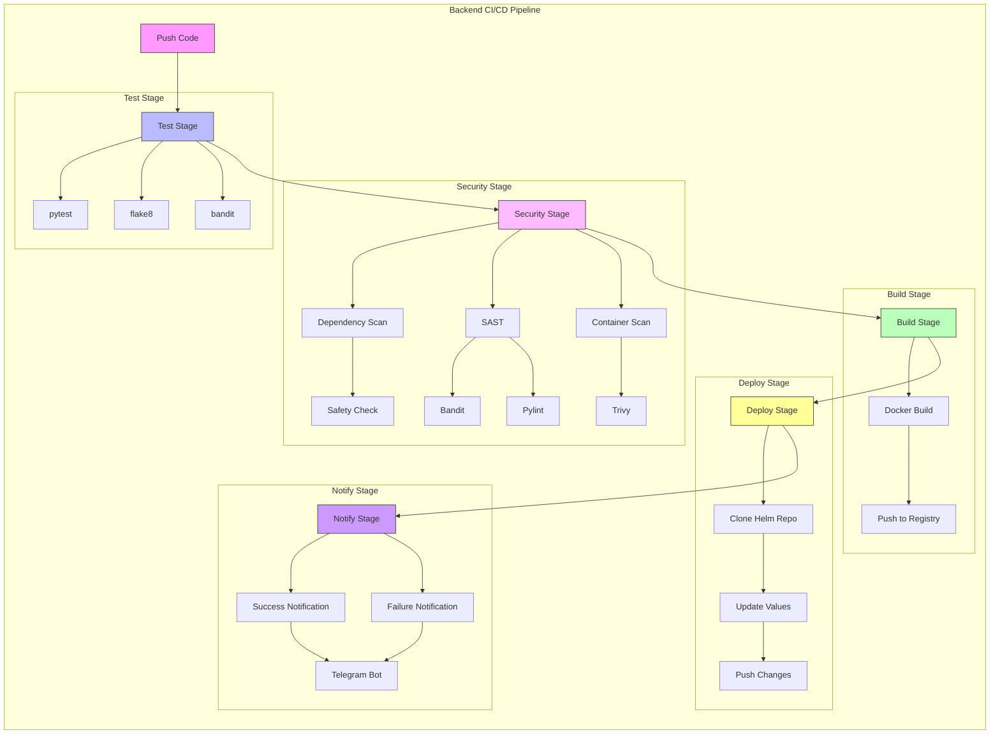
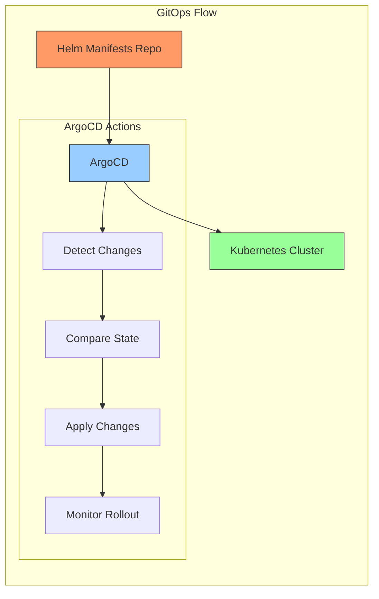
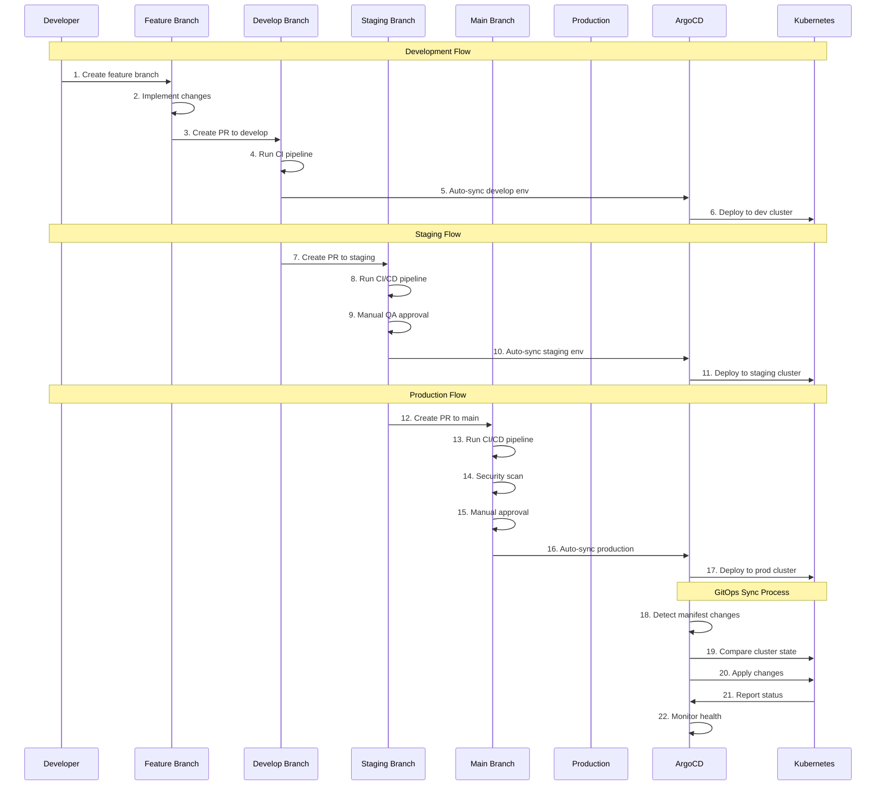

# E-commerce Backend Serviceeee

Flask-based backend service for the e-commerce platform with integrated CI/CD pipeline.

## Tech Stack

- **Framework**: Flask 2.0.1
- **Database**: 
  - MySQL (User data, Orders)
  - MongoDB (Product reviews)
- **Message Queue**: RabbitMQ
- **Python Version**: 3.8

## Pipeline Architecture

The CI/CD pipeline is designed to ensure code quality, security, and automated deployment with the following stages:



### Pipeline Stages Explanation:

1. **Push Code**: Triggers the pipeline when code is pushed to the repository
2. **Test Stage**: Ensures code quality and functionality
   - pytest: Runs unit and integration tests
   - flake8: Enforces Python code style (PEP 8)
   - bandit: Checks for common security issues
3. **Security Stage**: Multiple layers of security scanning
   - Dependency Scan: Checks for known vulnerabilities in dependencies
   - SAST: Static Application Security Testing
   - Container Scan: Analyzes Docker images for vulnerabilities
4. **Build Stage**: Creates and publishes Docker images
   - Builds optimized container images
   - Pushes to secure container registry
5. **Deploy Stage**: GitOps-based deployment
   - Updates Helm charts
   - Manages configuration changes
6. **Notify Stage**: Communication and reporting
   - Sends notifications about pipeline status
   - Provides detailed build information



### GitOps Flow Explanation:

1. **Helm Manifests Repo**: Source of truth for deployment configuration
2. **ArgoCD**: GitOps operator that manages deployments
   - Continuously monitors repository for changes
   - Ensures cluster state matches desired state
   - Handles rollouts and rollbacks
3. **Kubernetes Cluster**: Production environment
   - Runs containerized applications
   - Manages scaling and availability

## CI/CD Technologies and Tools

### Test Stage Tools
- **pytest (v6.2.4+)**
  - Feature-rich testing framework
  - Supports async testing
  - Extensive plugin ecosystem
  - Detailed test reports

- **flake8 (v3.9.2+)**
  - Enforces code style consistency
  - Identifies potential errors
  - Customizable rule sets
  - Integration with CI pipelines

- **bandit (v1.7.0+)**
  - AST-based security linter
  - Identifies common security issues
  - Configurable security rules
  - CI/CD integration support

### Security Stage Tools
- **Safety Check**
  - Scans Python dependencies
  - Uses PyUp.io security database
  - Regular vulnerability updates
  - Detailed security reports

- **Trivy (v0.18.3+)**
  - Comprehensive vulnerability scanner
  - Supports multiple OS packages
  - Fast and accurate scanning
  - Integration with CI/CD

### Build Stage Tools
- **Docker (v20.10.16)**
  - Multi-stage builds
  - Layer caching
  - Security best practices
  - Optimized image sizes

### Deploy Stage Tools
- **ArgoCD (v2.7.0)**
  - Declarative GitOps tool
  - Automated sync
  - Rollback capabilities
  - Health monitoring

### Notification Tools
- **Telegram Bot API**
  - Real-time notifications
  - Rich message formatting
  - Secure communication
  - Customizable alerts

## CI/CD Components

### 1. Test Stage
- **Unit Testing**: pytest
- **Code Linting**: flake8
- **Security Linting**: bandit
- **Cache**: `.pytest_cache/`, `.cache/`

### 2. Security Stage
- **Dependency Scanning**: Safety
- **SAST**: 
  - Bandit (Security-focused)
  - Pylint (Code quality)
- **Container Scanning**: Trivy
- **Artifacts**: Security reports in JSON format

### 3. Build Stage
- **Docker**: v20.10.16
- **Base Image**: python:3.8-slim
- **Registry**: GitLab Container Registry

### 4. Deploy Stage
- **Tool**: ArgoCD v2.7.0
- **Method**: GitOps
- **Target**: Kubernetes cluster

### 5. Notify Stage
- **Success Notification**: Pipeline completion details
- **Failure Notification**: Error reporting
- **Platform**: Telegram
- **Information**:
  - Project and branch
  - Commit details
  - Image information
  - Test coverage
  - Pipeline URL
  - Build status

## Local Development

1. **Setup Virtual Environment**:
```bash
python -m venv venv
source venv/bin/activate  # On Windows: .\venv\Scripts\activate
```

2. **Install Dependencies**:
```bash
pip install -r requirements.txt
```

3. **Run Development Server**:
```bash
flask run
```

## Docker Build

```bash
docker build -t ecommerce-backend .
docker run -p 5000:5000 ecommerce-backend
```

## Pipeline Configuration

The pipeline is configured in `.gitlab-ci.yml` and includes:

1. **Test Configuration**:
```yaml
test:
  stage: test
  script:
    - pip install -r requirements.txt
    - python -m pytest
```

2. **Security Scanning**:
```yaml
dependency-scan:
  stage: security
  script:
    - pip install safety
    - safety check
```

3. **Build & Deploy**:
```yaml
build:
  image: docker:20.10.16
  services:
    - docker:20.10.16-dind
```

## Required Environment Variables

- `MYSQL_HOST`: MySQL server host
- `MYSQL_USER`: MySQL username
- `MYSQL_PASSWORD`: MySQL password
- `MONGODB_URI`: MongoDB connection string
- `RABBITMQ_URL`: RabbitMQ connection URL
- `JWT_SECRET_KEY`: Secret key for JWT tokens
- `TELEGRAM_BOT_TOKEN`: Telegram bot API token
- `TELEGRAM_CHAT_ID`: Target chat/channel ID for notifications

## Security Features

1. **Dependency Security**:
   - Regular vulnerability scanning
   - Automated updates via pipeline
   - Security advisories monitoring

2. **Code Security**:
   - SAST scanning
   - Security linting
   - Best practices enforcement

3. **Container Security**:
   - Base image scanning
   - Layer vulnerability analysis
   - Runtime security checks

## Deployment

The deployment follows a GitOps approach using separate repositories for application code and deployment manifests:

### Repository Structure
```
application-repo/           # This repository
  ├── app.py              # Backend application code
  ├── requirements.txt    # Python dependencies
  ├── Dockerfile          # Container build instructions
  └── .gitlab-ci.yml      # CI/CD pipeline configuration

helm-manifests-repo/       # Separate repository for Helm charts
  └── ecommerce/          # Helm chart for the entire application
      ├── Chart.yaml      # Chart metadata
      ├── values.yaml     # Default values (updated by CI/CD)
      └── templates/      # Kubernetes manifests templates
```

### GitOps Workflow

1. **Code Changes**:
   - Developer pushes code to the backend repository
   - CI/CD pipeline builds new container image
   - Image is tagged with commit SHA and pushed to registry

2. **Manifest Updates**:
   - Pipeline clones the helm-manifests repository
   - Updates the backend image tag in values.yaml
   - Commits and pushes changes to manifest repository

3. **Automated Deployment**:
   - ArgoCD detects changes in helm-manifests repository
   - Compares current state with desired state
   - Applies changes to the Kubernetes cluster
   - Monitors rollout status

### ArgoCD Configuration

```yaml
apiVersion: argoproj.io/v1alpha1
kind: Application
metadata:
  name: ecommerce
  namespace: argocd
spec:
  project: default
  source:
    repoURL: https://gitlab.com/your-group/helm-manifests.git
    targetRevision: HEAD
    path: ecommerce
  destination:
    server: https://kubernetes.default.svc
    namespace: ecommerce
  syncPolicy:
    automated:
      prune: true
      selfHeal: true
```

### Required CI/CD Variables

- `HELM_REPO_SSH_KEY`: SSH key for helm-manifests repository access
- `HELM_MANIFEST_REPO`: URL of the helm-manifests repository
- `HELM_MANIFEST_BRANCH`: Target branch for manifest updates (default: main)

## Monitoring

- Application metrics via Prometheus
- Log aggregation with ELK stack
- Error tracking with Sentry 

## GitOps Branch Strategy and Deployment Flow



### Detailed Flow Explanation

#### Development Flow (Steps 1-6)
1. Developer creates a new feature branch from the develop branch
2. Developer implements and commits changes to the feature branch
3. Developer creates a Pull Request (PR) to merge changes into the develop branch
4. CI pipeline runs automatically on the develop branch (tests, linting, etc.)
5. Upon successful merge, ArgoCD detects changes in the develop environment
6. ArgoCD automatically deploys changes to the development Kubernetes cluster

#### Staging Flow (Steps 7-11)
7. Developer/Team Lead creates a PR from develop to staging branch
8. CI/CD pipeline runs on the staging branch
9. QA team performs manual testing and approves the changes
10. Upon approval and merge, ArgoCD detects changes in staging environment
11. ArgoCD deploys changes to the staging Kubernetes cluster

#### Production Flow (Steps 12-17)
12. Team Lead creates a PR from staging to main branch
13. CI/CD pipeline runs comprehensive tests on main branch
14. Security scans are performed (SAST, DAST, dependency checks)
15. Required approvers review and approve the production deployment
16. Upon approval and merge, ArgoCD detects changes in production environment
17. ArgoCD deploys changes to the production Kubernetes cluster

#### GitOps Sync Process (Steps 18-22)
18. ArgoCD continuously monitors Git repository for manifest changes
19. When changes are detected, ArgoCD compares desired state with cluster state
20. ArgoCD applies necessary changes to bring cluster to desired state
21. Kubernetes cluster reports deployment status back to ArgoCD
22. ArgoCD monitors the health and status of the deployed applications

### Key Benefits
- **Automated Deployments**: Consistent deployment process across all environments
- **Version Control**: All changes are tracked in Git
- **Rollback Capability**: Easy rollback to previous versions if issues arise
- **Security**: Multiple validation steps before production deployment
- **Visibility**: Clear audit trail of all changes and deployments
- **Quality Assurance**: Structured testing process in development and staging 