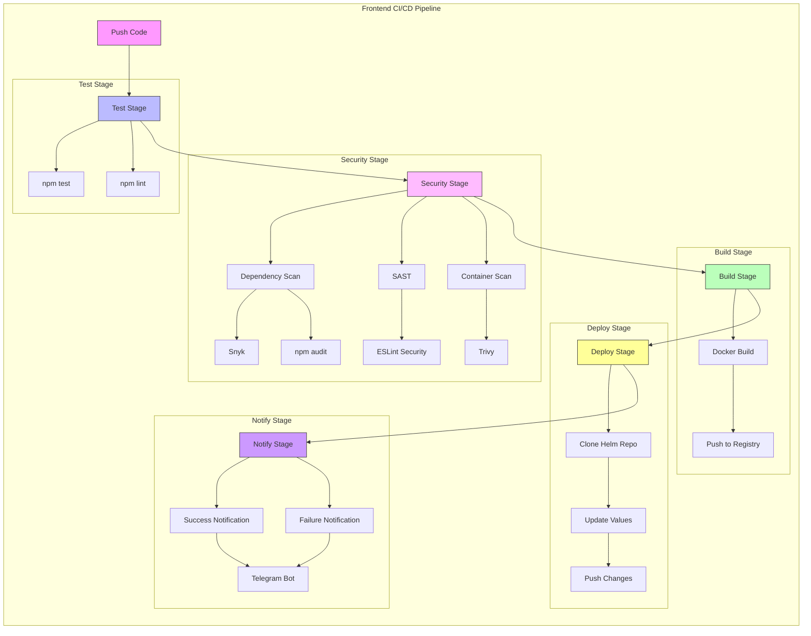
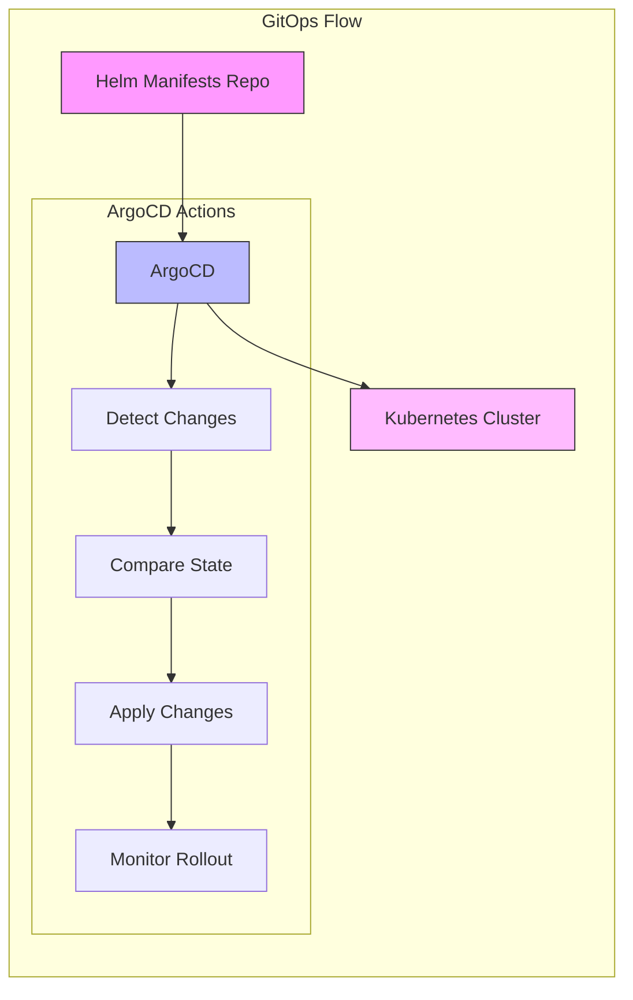

# E-commerce Frontend Service

React-based frontend service for the e-commerce platform with integrated CI/CD pipeline.

## Tech Stack

- **Framework**: React 18.2.0
- **UI Library**: Material-UI (MUI)
- **State Management**: React Hooks
- **Routing**: React Router 6.4.0
- **HTTP Client**: Axios
- **Node Version**: 16.x

## Pipeline Architecture

The CI/CD pipeline is designed to ensure code quality, security, and automated deployment of the frontend application with the following stages:



### Pipeline Stages Explanation:

1. **Push Code**: Initiates the pipeline
   - Triggers on new commits
   - Supports feature branches and main branch
   - Validates commit messages

2. **Test Stage**: Frontend testing and quality checks
   - npm test: Runs Jest unit tests and component tests
   - npm lint: Enforces code style and best practices
   - Generates test coverage reports
   - Validates component rendering

3. **Security Stage**: Multi-layer security validation
   - Dependency Scan:
     - Snyk: Deep dependency vulnerability scanning
     - npm audit: Node.js package vulnerability checks
   - SAST: Static code analysis with ESLint security rules
   - Container Scan: Docker image vulnerability scanning

4. **Build Stage**: Production build creation
   - Optimizes assets and bundles
   - Creates production-ready Docker images
   - Implements multi-stage builds for size optimization
   - Pushes to secure container registry

5. **Deploy Stage**: GitOps deployment process
   - Updates Helm configuration
   - Manages environment variables
   - Handles configuration updates
   - Ensures zero-downtime deployments

6. **Notify Stage**: Pipeline status communication
   - Real-time status updates
   - Detailed error reporting
   - Build metrics and statistics
   - Team notifications via Telegram



### GitOps Flow Explanation:

1. **Helm Manifests Repository**:
   - Central source for deployment configurations
   - Version controlled infrastructure
   - Environment-specific configurations
   - Deployment history tracking

2. **ArgoCD Deployment**:
   - Automated sync with Git repository
   - Real-time deployment monitoring
   - Automatic drift detection
   - Self-healing capabilities

3. **Kubernetes Environment**:
   - Scalable container orchestration
   - High availability setup
   - Resource optimization
   - Automated load balancing

## CI/CD Technologies and Tools

### Test Stage Tools
- **Jest (v27+)**
  - React testing framework
  - Snapshot testing
  - Code coverage reporting
  - Async testing support
  - Component testing

- **ESLint (v8+)**
  - JavaScript/TypeScript linting
  - React-specific rules
  - Airbnb style guide integration
  - Auto-fix capabilities
  - Custom rule configuration

### Security Stage Tools
- **Snyk**
  - Real-time dependency scanning
  - Vulnerability database
  - License compliance checking
  - Fix recommendations
  - Integration with CI/CD

- **npm audit**
  - Built-in security scanning
  - Package vulnerability checks
  - Automated auditing
  - Detailed security reports
  - Remediation suggestions

- **ESLint Security Plugin**
  - Security-focused linting rules
  - Common vulnerability detection
  - React security best practices
  - Custom security rules
  - Automated scanning

- **Trivy (v0.18.3+)**
  - Container vulnerability scanning
  - Node.js package scanning
  - OS package vulnerability detection
  - SBOM generation
  - Low false-positive rat- **Snyk**
  - Real-time dependency scanning
  - Vulnerability database
  - License compliance checking
  - Fix recommendations
  - Integration with CI/CD

- **npm audit**
  - Built-in security scanning
  - Package vulnerability checks
  - Automated auditing
  - Detailed security reports
  - Remediation suggestions

- **ESLint Security Plugin**
  - Security-focused linting rules
  - Common vulnerability detection
  - React security best practices
  - Custom security rules
  - Automated scanning

- **Trivy (v0.18.3+)**
  - Container vulnerability scanning
  - Node.js package scanning
  - OS package vulnerability detection
  - SBOM generation
  - Low false-positive ratee

### Build Stage Tools
- **Docker (v20.10.16)**
  - Multi-stage builds
  - Node.js optimized images
  - Build caching
  - Production optimization
  - Nginx configuration

### Deploy Stage Tools
- **ArgoCD (v2.7.0)**
  - GitOps deployment
  - Automated synchronization
  - Rollback support
  - Health monitoring
  - Progressive delivery

### Notification Tools
- **Telegram Bot API**
  - Real-time build notifications
  - Formatted messages
  - Build status updates
  - Error reporting
  - Team collaboration

## CI/CD Components

### 1. Test Stage
- **Unit Testing**: Jest with React Testing Library
- **Integration Testing**: Cypress
- **Code Linting**: ESLint + Prettier
- **Cache**: `node_modules/`, `.npm/`

### 2. Security Stage
- **Dependency Scanning**: 
  - Snyk for real-time vulnerability detection
  - npm audit for package security
- **SAST**: ESLint Security Plugin
- **Container Scanning**: Trivy
- **Artifacts**: Security reports in JSON/HTML format

### 3. Build Stage
- **Docker**: v20.10.16
- **Base Image**: node:18-alpine
- **Registry**: GitLab Container Registry
- **Build Optimization**:
  - Multi-stage builds
  - Production bundling
  - Asset optimization
  - Cache management

### 4. Deploy Stage
- **Tool**: ArgoCD v2.7.0
- **Method**: GitOps
- **Target**: Kubernetes cluster
- **Configuration**: Helm charts

### 5. Notify Stage
- **Success Notification**: 
  - Build completion
  - Test coverage
  - Security status
- **Failure Notification**: 
  - Error details
  - Failed stage
  - Log snippets
- **Platform**: Telegram
- **Information**:
  - Project and branch
  - Commit details
  - Build status
  - Test results
  - Security scan results

## Local Development

1. **Install Dependencies**:
```bash
npm install
```

2. **Start Development Server**:
```bash
npm start
```

3. **Run Tests**:
```bash
npm test
```

4. **Run Linting**:
```bash
npm run lint
```

## Docker Build

```bash
docker build -t ecommerce-frontend .
docker run -p 3000:3000 ecommerce-frontend
```

## Pipeline Configuration

The pipeline is configured in `.gitlab-ci.yml` and includes:

1. **Test Configuration**:
```yaml
test:
  stage: test
  script:
    - npm ci
    - npm run test
```

2. **Security Scanning**:
```yaml
dependency-scan:
  stage: security
  script:
    - npm ci
    - npm install -g snyk
    - snyk test
```

3. **Build & Deploy**:
```yaml
build:
  image: docker:20.10.16
  services:
    - docker:20.10.16-dind
```

## Required Environment Variables

- `REACT_APP_API_URL`: Backend API URL
- `REACT_APP_GA_ID`: Google Analytics ID
- `CI_REGISTRY_IMAGE`: GitLab registry path
- `ARGOCD_AUTH_TOKEN`: ArgoCD authentication token
- `TELEGRAM_BOT_TOKEN`: Telegram bot API token
- `TELEGRAM_CHAT_ID`: Target chat/channel ID for notifications

## Security Features

1. **Dependency Security**:
   - Regular vulnerability scanning
   - Automated updates via pipeline
   - Security advisories monitoring

2. **Code Security**:
   - SAST scanning
   - Security linting
   - XSS prevention

3. **Container Security**:
   - Base image scanning
   - Layer vulnerability analysis
   - Runtime security checks

## Deployment

The deployment follows a GitOps approach using separate repositories for application code and deployment manifests:

### Repository Structure
```
application-repo/           # This repository
  ├── src/                 # Frontend source code
  ├── Dockerfile          # Container build instructions
  └── .gitlab-ci.yml      # CI/CD pipeline configuration

helm-manifests-repo/       # Separate repository for Helm charts
  └── ecommerce/          # Helm chart for the entire application
      ├── Chart.yaml      # Chart metadata
      ├── values.yaml     # Default values (updated by CI/CD)
      └── templates/      # Kubernetes manifests templates
```

### GitOps Workflow

1. **Code Changes**:
   - Developer pushes code to the frontend repository
   - CI/CD pipeline builds new container image
   - Image is tagged with commit SHA and pushed to registry

2. **Manifest Updates**:
   - Pipeline clones the helm-manifests repository
   - Updates the frontend image tag in values.yaml
   - Commits and pushes changes to manifest repository

3. **Automated Deployment**:
   - ArgoCD detects changes in helm-manifests repository
   - Compares current state with desired state
   - Applies changes to the Kubernetes cluster
   - Monitors rollout status

### ArgoCD Configuration

```yaml
apiVersion: argoproj.io/v1alpha1
kind: Application
metadata:
  name: ecommerce
  namespace: argocd
spec:
  project: default
  source:
    repoURL: https://gitlab.com/your-group/helm-manifests.git
    targetRevision: HEAD
    path: ecommerce
  destination:
    server: https://kubernetes.default.svc
    namespace: ecommerce
  syncPolicy:
    automated:
      prune: true
      selfHeal: true
```

### Required CI/CD Variables

- `HELM_REPO_SSH_KEY`: SSH key for helm-manifests repository access
- `HELM_MANIFEST_REPO`: URL of the helm-manifests repository
- `HELM_MANIFEST_BRANCH`: Target branch for manifest updates (default: main)

## Nginx Configuration

The production build uses Nginx for serving static files and handling routing:

```nginx
server {
    listen 3000;
    root /usr/share/nginx/html;
    index index.html;

    location / {
        try_files $uri $uri/ /index.html;
    }

    location /api {
        proxy_pass http://backend:5000;
    }
}
```

## Monitoring

- Application performance monitoring with Google Analytics
- Error tracking with Sentry
- User behavior analytics
- Performance metrics collection 